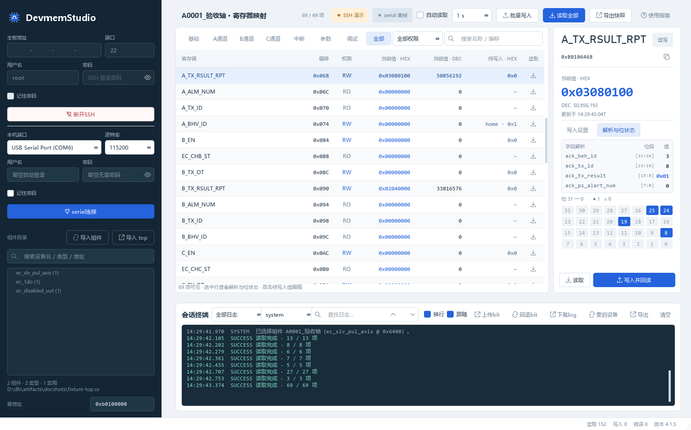
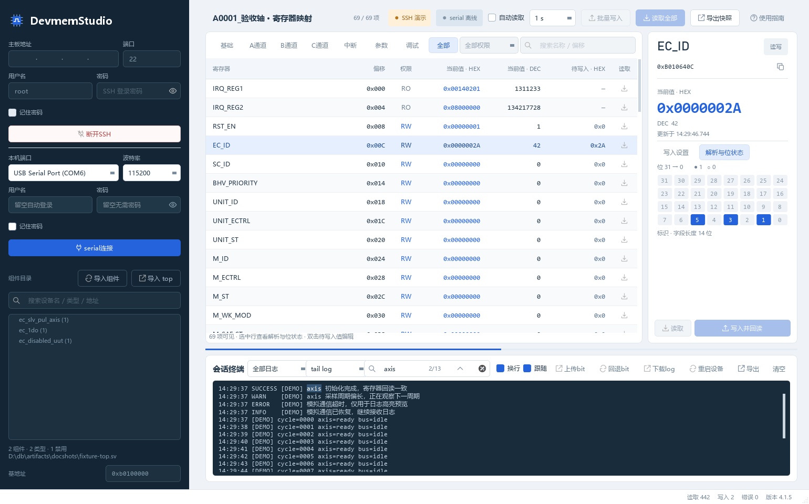
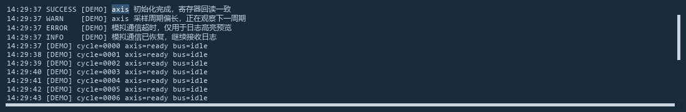
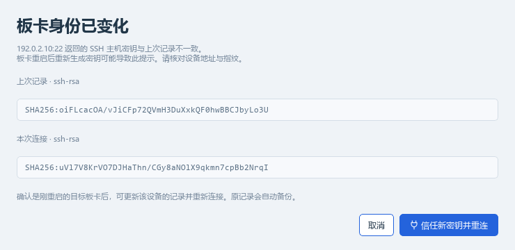

# 寄存器调试工作台 4.1.5

作者：szzhang / cgliu / bxli

面向 FPGA / Linux 开发板的 SSH 寄存器调试工作台。以组件为中心：导入 RTL 顶层文件后直接选择组件调试，寄存器表精确到组件类型。



## 当前流程：选组件 · 切视图

- 界面不再有「模块目录」和「基地址 + 组件地址」栏：**左侧「导入 top」→ 组件目录（按类型分组、可搜索）→ 点击组件**即锁定其 `REG_SPACE_BIAS` 地址并加载该类型的精确寄存器表。标题行显示设备名、类型徽标、全地址；基地址自动取自 `components_param.vh`（找不到时左侧出现可编辑的基地址框）。
- 寄存器区新增八个**视图页签**，按 RTL 实测语义切分该组件的寄存器：
  - **基础**：`RST_EN`（写 1 运行 / 0 复位保持）、`EC_ID/SC_ID/BHV_PRIORITY`（仲裁序 0:abc…5:cba）、`UNIT_*/M_*/M_WK_MOD`（=3 手动模式拒绝 A 通道行为）、`M_SAF_ST/LINK_M_SAF_ST`
  - **A通道 / B通道 / C通道**：三个通道各自独立一页。每页含该通道的 `X_EN`（门控，A 复位默认开、C 默认关）、`X_BHV_ID`（行为触发，**预设直接来自 RTL 的行为表注释**，如 home/jog/move[jog[safe]）、`X_TX_OT`（超时，单位秒）、`EC_CHx_ST`（通道忙）、`X_TX_ID`（10/20/30/40 事务）、`X_ALM_NUM`（100 预检超时…106 强制停止…110 手动模式）；A 通道另含 `A_TASK_ID/A_TASK_BHV_ID`，C 通道另含 `C_GAP_CRL`（心跳周期 ms，0 关）
  - **中断**：`IRQ_REG1`（ec_id[31:18]/sc_id[17:8]/bhv_id[7:0]）、`IRQ_REG2`（tx_id/alm_num，锁存不自动清）**及 A/B/C `X_TX_RSULT_RPT` 上报应答**（PS 写 `{beh,tx,0x51/0x52,alm}` 应答中断）
  - **参数**：该类型实现的 PARAM 子集，**每个参数都带标注**——有接线的显示实际信号名（`PARAM1 · rcfg_spd_max`、`PARAM64 · i_axis_limf`，来自 RTL 端口连接、assign、拼接表达式与端口注释收割）；顶层例化中被注释的标 `未接线`（读回值无意义）；只接空线、组件内未使用的标 `预留`。悬停另显示 RTL 注释与状态说明
  - **调试**：`DEBUG_REG1/2/3` = A/B/C 行为状态机历史，每字节一个状态（**四拍字段解码**：前第3拍/前第2拍/前第1拍/当前；状态 0 空闲 1 预检 2 发IRQ10 … 12/13 结束）；例外自动标注（dv300_do REG3=输出脚快照、2di_2do REG2=IRQ 边沿计数）
  - **全部**：完整精确表
- 读取全部 / 轮询 / 批量写入只作用于当前视图；视图只是过滤，切换不丢已读值和写入草稿。参数信号名参与搜索与 CSV 快照。权限过滤改为下拉（全部/只读/可读写）；未实现寄存器不出现在表里（`BHV_EN` 等读取返回 0x7FFFFFFF 的已剔除）。

### top 组件解析与精确寄存器表

- 导入 top 解析 `flow_comp` 组件（设备名/类型/地址/禁用态），重启自动重载；类型无精确表时回退通用表并标 `≈`。
- 寄存器表由 `tools/gen_component_catalog.py` 从 `reg_addr_pl.vh` + 各 `ps_rw_pl_reg_*.sv` 生成（含 PARAM 注释与行为表收割），打包于 `devmem_studio/data/component_catalog.json`；RTL 变更后重跑脚本刷新。

### 运行时导入组件（RTL 改动后免重新打包）

某个组件**内部**修改后，在发布版 EXE 里点「导入组件」，选择该组件的文件夹（如 `...\pl_exe_io\ec_dv300_do\`，需含 `ps_rw_pl_reg_*.sv`，可选同级 `ec_*.sv`；寄存器地址表从上级 `include_files/reg_addr_pl.vh` 向上查找）：

- 解析出的寄存器表/信号名/行为表/DEBUG 语义**立即覆盖**内置定义并作用于该类型组件（正在查看的组件自动刷新）
- 定义持久化到 `%LOCALAPPDATA%\DevmemStudio\component_overrides\<类型>.json`，重启自动加载；删除该文件即恢复内置定义
- 与生成器同源（`devmem_studio/component_parse.py`），两端解析结果一致

## 4.1.5 发布

- 顶部横幅移除：会话状态（等待提示 + SSH/serial 徽章）并入寄存器区标题行「自动读取」左侧，「使用指南」移至「导出快照」右侧，分区标题与下方卡片边缘对齐。
- 徽章、按钮、下拉框统一 32px 高；离线底色加深（原色与工作区背景几乎同色）、已连接绿底加深、信号中状态新增（serial 连接中）。
- serial 新增「连接中」徽章状态；SSH 连接中状态由统一判断维护，修复并发刷新打回离线、主机密钥等待时卡连接中的问题。
- 侧栏可拖拽调宽（与寄存器/终端分隔条同款 9px 手柄）。
- 寄存器标题行在 1180–1920 宽度下不再重叠：固定控件钉住宽度，标题吃余量，长文本走 tooltip。

## 4.1.1 发布

- 会话终端重构：终端本身即 shell。会话终端顶部来源选择器分为 tail log / ssh / serial / system 四个来源，各来源缓冲完全隔离；切换来源即切换终端内容，默认落在 system、不记忆。
- 终端即 shell：ssh / serial 视图底部有 `❯` 提示行，直接输入命令回车执行，`↑`/`↓` 翻历史；tail log / system 视图只读。
- 串口连接独立于 SSH：两条连接可同时在线、互不干扰；两个连接按钮互不禁用。连接中按钮变红「取消连接」，可随时主动中止（SSH 握手可中断、串口握手可取消）。
- 取消可用后移除超时设置：连接超时固定为 8 秒，不再提供数字调节。
- serial 登录握手超时兜底：检测 login 提示后按固定超时等待密码/prompt，超时抛出「串口登录超时」而非半连接成静默 shell。
- 串口连接期间显示与 SSH 相同的不定进度条。
- 右上角双状态徽章：SSH/serial 各自独立的连接状态（离线/连接中/已连接/演示），圆点等大、徽章定宽防跳动。
- 断开连接按钮变红色断开态。
- 底栏左侧状态栏移除：全部提示并进 system 终端，底栏只留读写错误计数与版本号。
- 查找日志：随输随查、当前/总数匹配计数、选中终端文字 Ctrl+F 自动填充；导出当前终端缓冲区为 `session_YYYYMMDDHHMMSS.log`。
- 连接生命周期消息（连接/断开/错误）路由到 system 终端，会话输出进入 ssh/serial 各自缓冲。

## 4.0.2 更新

### 组件 top 导入解析增强

- 组件标签格式兼容两种写法：`-----标签`（标签紧跟横线，如 `// --- flow_comp_1 -----进料1`）与 `--标签---`（双横线分隔），CRLF / LF 换行均正确解析。
- 按 `ec_*` 解析组件：每个 `flow_comp` 块内取**注释深度最浅**的 `ec_*` 声明作为真实组件类型（0=激活代码，>0=注释）。旧的嵌套参考模板（如 `//    // ec_sp_rfid`）不再干扰，真实例化优先于参考模板，禁用态正确标注。
- 无标签组件不再显示空白：header 未写设备名时自动回退为**实例名**（如 `ec_1di_32`、`ec_s7_plc_134`），目录树、标题、CSV 导出全部一致。
- 识别双重注释（`//    // ec_x`）与混合结构（注释参考 + 激活例化共存于同一块）的 top 文件；块内注释过的过时 `REG_SPACE_BIAS` 不会覆盖真实地址。
- 最后一个组件块以 `endmodule` 为界截断，长文件末尾的组件也能完整解析（原先是固定 200 字符截断）。

### bit 上传校验与确认

- 严格校验 `*.bit` 后缀（大小写不敏感）：选择、粘贴、拖入、点上传四个入口都会拦截，非 bit 文件提示「选中文件不是bit文件」。
- 上传前弹出确认框，显示**文件完整路径与文件日期**（修改时间），确认后才开始备份与上传。

### 脉冲域位置信号按补码显示

- `rserv_target_pulse` / `rserv_step_pulse` 即使端口未声明 `input signed` 也按补码 DEC 显示（负值正确显示为负数，如 `0xFFFFFF9C → -100`），与其它位置/速度寄存器一致显示「实际值 (mm | °)」。

### 其它易用性

- 轮询间隔可编辑输入（最小 0.1 s，即 100 ms），支持 `0.3`、`150ms`、`500` 等写法。
- 选中任意寄存器默认切到「解析与位状态」页签。
- 批量读取合并为单条 shell 命令，会话日志压缩为单行（`读取 N 个寄存器 0x...`），不再逐寄存器刷屏。
- 移除「停止」按钮（保留 Esc 取消与批量操作的立即停止）。

## 4.0.2 发布

- 移除界面左下角侧栏底部的「SSH / LINUX / MMIO」静态标签。
- exe 精简：剔除 Qt6Network / Qt6OpenGL / qdirect2d 等无引用 DLL 与插件，体积 34.1 → 29.8 MB。
- smoke 验收适配 4.0.0 起的寄存器默认 DEC 显示；补全 exe 文件属性版本书写。

## 4.0.1 发布

- 内嵌使用指南补充「回退bit」，操作步骤、快捷键与开发者条目统一编号。
- 排版美化：标题蓝色、正文/代码黑橙分色、字号层级调整。
- README 使用流程精简为 6 步，同步回退 bit 与导入时序说明。

## 4.0.0 发布

- 新增「回退bit」（上传bit 右侧）：列出板端 `/run/media/sda` 下的 `sunny_fpga.bit*` 备份。
- 选择版本后二次确认；回退时当前 bit 备份为 `sunny_fpga.bit_时间戳`，所选版本恢复为 `sunny_fpga.bit`。
- `SshSession` / `DemoSession` 新增 `list_bit_backups()`、`rollback_bit()`（SFTP rename），含单元与 UI 测试。

## 3.3.2 发布

- 有符号参数的补码 DEC 显示：从 RTL 端口声明收割 signed 属性（目录 schema 8），`ec_slv_pul_axis` / `ec_pul_axis` 的 PARAM51（`r_pf_abspos`）自动标记。
- DEC 显示按二进制补码转有符号数：表格列、检查器、CSV 快照三处统一（`0xFFFFFF9C → -100`）；HEX 与位状态不变。

## 3.3.1 发布

- 使用指南末尾新增标准条目「Auth：szzhang / cgliu / bxli」。

## 3.3.0 发布

- 拼接型参数接线（如 `param52 = {30'd0, b_reset, param16[0]}`）解析出每根信号线及其位位置，跨参数引用保留位选形式（`param16[0]`），不再只显示第一个元素。
- 寄存器条目带 fields 位级布局（目录 schema 7），表格列、搜索、悬停、CSV 与「解析与位状态」五处显示一致。
- 「解析与位状态」面板按字段数动态增行，一行一个 RTL 信号，随读取值实时刷新；DEBUG 位快照同样逐位显示。

## 3.1.0 发布

- 会话终端新增「上传bit」：选择或拖入 `.bit`，重命名为 `sunny_fpga.bit` 经 SFTP 上传到 `/run/media/sda`，板端原文件自动备份为 `sunny_fpga.bit_时间戳`；细线进度条平滑补间显示进度。
- 新增「下载log」：板端 `/run/media/sda/sunny.log` 下载到本地，可选保存位置，进度条显示传输进度。
- 上传 / 下载 / 重启仅需连接设备即可使用，不再依赖选中组件；`DemoSession` 增加模拟上传/下载供离线验收。
- 修复：上传 Worker 引用未保存导致完成回调丢失、`_busy` 卡死；细条进度条忙碌动画显示问题。

## 3.0.0 发布

- 「导入组件」：单个组件文件夹或上级目录批量重新解析寄存器定义，持久化于本机 `component_overrides`，免改源码免打包（解析层与生成器同源）。
- 组件目录扁平单列布局：选中条整行绘制、一二级一致无撕裂，一级 4 空格 / 二级 8 空格缩进，去掉箭头符号。
- 一键打开日志窗口支持最小化/最大化；IRQ 寄存器双保险；测试与本机导入覆盖通过环境变量隔离。
- 107 项单元测试 + 83 项离线验收。

## 2.2.1 发布

- 寄存器映射默认选中「基础」页签；组件树吸收侧栏全部纵向富余，消除高窗口下的空白段。

## 2.2.0 初始版本

- 组件中心化调试台：导入 emcc mix top 解析组件，寄存器表由 RTL（`reg_addr_pl.vh` + `ps_rw_pl_reg_*.sv` + `ec_<type>.sv`）自动生成，含信号名收割、行为预设、DEBUG 位快照/状态历史自动分类。
- 视图：基础 / A通道 / B通道 / C通道 / 中断 / 参数 / 调试 / 全部。
- 101 项单元测试 + 80 项离线验收。

## 本次优化

- 打印日志窗口默认开启「自动换行」与「显示行号」，可分别勾选切换。长文本、连续十六进制数据随窗口宽度自动折行。
- 左侧按当前缓存的原始行编号，折行后的续行不重复编号；与 Ctrl+G 跳转对应。行号宽度随位数、字体和窗口缩放调整。
- 换行和行号不改变复制、保存的日志原文；切换显示时保留查找匹配和自动跟随状态，日志继续接收。

## 2.0.7 优化

- irq1 / irq2 使用给出的完整字段名解析，结果显示为十进制；irq1 沿用当前项目的 14 / 10 / 8 位划分。
- a / b / c rpt 按四个字节解析，`ack_tx_result` 显示为两位十六进制（例如 `0xA5`），其他字段显示十进制。
- 选中寄存器后，在右侧「解析与位状态」查看对齐的字段名、位区间与数值。小窗口自动露出完整字段表；读取失败时清除旧解析值。
- 字段名与进制同步用于当前值的悬停提示和 CSV 快照。
- 左侧新增「基础」，包含给出的 15 个可读写寄存器，默认 32 位访问；支持读取、写入回读、轮询、批量写入及写入值记忆。



### 字段解析规则

| 寄存器 | 字段 | 位区间 | 显示进制 |
|---|---|---|---|
| irq1 | ec_id | [31:18] | 十进制 |
| irq1 | sc_id | [17:8] | 十进制 |
| irq1 | r_a_bhv_id | [7:0] | 十进制 |
| irq2 | r_a_tx_id | [31:24] | 十进制 |
| irq2 | r_a_alm_num | [23:16] | 十进制 |
| a / b / c rpt | ack_beh_id | [31:24] | 十进制 |
| a / b / c rpt | ack_tx_id | [23:16] | 十进制 |
| a / b / c rpt | ack_tx_result | [15:8] | 十六进制 |
| a / b / c rpt | ack_ps_alart_num | [7:0] | 十进制 |

irq2 的低 16 位为给出的 `16'd0` 保留区，不作为解析字段显示。字段名 `ack_ps_alart_num` 按提供的信号名保留。

### 基础组件寄存器

以下寄存器均可读写，默认按 32 位总线访问。完整地址仍为「基地址 + 组件地址 + 偏移」。

| 名称 | 偏移 | 名称 | 偏移 |
|---|---|---|---|
| EC_ID | 0x00C | M_ST | 0x02C |
| SC_ID | 0x010 | M_WK_MOD | 0x030 |
| BHV_PRIORITY | 0x014 | BHV_EN | 0x034 |
| UNIT_ID | 0x018 | M_SAF_ST | 0x038 |
| UNIT_ECTRL | 0x01C | LINK_M_SAF_ST | 0x03C |
| UNIT_ST | 0x020 | A_TASK_ID | 0x054 |
| M_ID | 0x024 | A_TASK_BHV_ID | 0x058 |
| M_ECTRL | 0x028 | | |

## 2.0.6 优化

- 独立日志窗口增加错误、告警、成功和调试高亮，时间戳与十六进制地址、数值使用独立颜色。
- Ctrl+F 快速查找，所有匹配同时高亮，并显示「当前匹配 / 匹配总数」。支持区分大小写，按普通文本匹配，输入 `.*` 或 `[]` 也可直接查找原字符。
- Enter / F3 跳转下一处，Shift+Enter / Shift+F3 跳转上一处，首尾循环查找。查找框中按 Esc 清空查找。
- Ctrl+G 输入行号并按 Enter，直接定位当前缓存中的对应行；「回到最新」恢复自动跟随。
- 查找、跳转和向上浏览时暂停自动滚动，日志继续接收，匹配数继续更新，主窗口保持可读写。最多保留最近 5000 行，旧行淘汰后重新计算位置与匹配数。



## 2.0.5 修复

- 修复板卡重启后遇到 `Host key for server ... does not match` 时缺少恢复入口的问题。
- 密钥发生变化时，弹窗展示设备地址及旧、新 SHA-256 指纹；核对后点击「信任新密钥并重连」，自动更新该设备的记录并重新连接。
- 原 `known_hosts` 自动备份，其他设备及共享条目中的其他主机记录保留。默认取消，取消时保留原记录并停止连接。
- 仅保存本次展示并确认的新密钥；如果重连时板卡再次返回不同密钥，会再次要求核对。



若每次重启都出现该提示，应检查板卡的 SSH 主机密钥是否在启动时重新生成，以及密钥文件是否存放于持久存储。当前报错能确认的是主机密钥与本机缓存不一致，具体板端原因需要现场检查。

## 2.0.4 优化

- 点击主窗口「打印日志」，立即打开独立窗口并执行 `tail -f /run/media/sda/sunny.log`，无需再次点击开始。
- 日志启动任务、SSH 日志通道与寄存器任务分离；启动和打印期间均可继续读写寄存器，自动读取不会因日志启动失败而停止。
- 停止或关闭日志窗口只结束日志通道；重复点击按钮激活已有窗口，避免重复启动同一个日志任务。
- 日志窗口支持停止、重新开始、清空和保存；文件不存在等错误显示在日志窗口。

## 2.0.3 修复

- 修复旧开发板连接时报 `Incompatible ssh peer (no acceptable host key)` 的兼容性问题：固定使用 Paramiko 4.0.0，恢复 `ssh-rsa` 和旧版 DH 密钥交换支持。
- 优先使用现代算法，保存过 RSA 主机密钥的设备仍优先使用 RSA/SHA-2；保留已有主机密钥校验。
- 会话日志显示实际协商的主机密钥与加密算法，算法不兼容时显示中文错误信息。

Paramiko 5.0 移除了 RSA/SHA-1 签名和 SHA-1 密钥交换，见[官方变更记录](https://github.com/paramiko/paramiko/blob/main/sites/www/changelog.rst)。本项目连接旧开发板时需要兼容这些算法，因此开发环境和 EXE 均固定使用 4.0.0；安装依赖请使用项目的 requirements 文件。

## 2.0.2 优化

- 主表与批量写入预览的表头、单元格采用一致的列对齐规则：名称左对齐，地址与数值右对齐，权限、位宽和操作列居中；统一文字边距。

## 2.0.1 优化

- 界面标题、模块导航、检查器权限标识与底部统计统一使用中文，移除重复英文翻译。寄存器名、HEX / DEC、SSH 等技术标识保留。
- 收紧主标题区及表格行高，在相同窗口中显示更多寄存器。
- 检查器固定显示当前寄存器名称与完整地址；切换至写入设置或缩小窗口时，自动露出写入区。
- 增大进制与位宽选择框，完整显示其选项。
- 区分写入失败和写入成功后的回读失败；后者明确提示“写入已完成”，记录已完成的写入次数并停止后续批量操作。

## 直接运行 EXE

双击 **`dist/DevmemStudio.exe`**。这是 Windows x64 单文件程序，已包含 Python、Qt、SSH 加密库以及所需的 Visual C++ 运行库，无需安装 Python 或配置 venv。首次启动需要将运行库解压到系统临时目录，通常比后续启动稍慢。

可复制这个 EXE 到其他目录或电脑使用。程序首次保存设置时会生成 `registers.json`。如果要沿用本机设备设置，可自行将项目中的 `registers.json` 放到 EXE 旁边；该文件可能包含保存的密码。发布包使用空白设备配置，不含本机设备凭据。

本次产物已在当前 Windows 11 x64 系统上验收；验收时 EXE 被复制到独立目录，PATH 仅保留 Windows 系统目录，并清除了 Python / venv 环境变量。

## 使用流程

1. 填写设备地址、端口、用户名和密码，点击「SSH连接」。设备端需要 SSH、可用的 shell 和 `devmem` 命令。需要串口控制台时，在下方 serial 区选本机端口、波特率与可选登录凭据（留空自动登录），点击「serial连接」——SSH 与 serial 两条连接相互独立、可同时在线，右上角徽章分别显示状态。
2. 连接前点击左侧「导入 top」选择 `emcc_mix_top.sv` 等顶层文件；组件目录按类型列出全部组件（可按设备名 / 类型 / 地址搜索，禁用组件灰色），点击组件即加载该类型的精确寄存器表并自动读取。基地址自动取自 `components_param.vh`。
3. 用「基础 / A通道 / B通道 / C通道 / 中断 / 参数 / 调试 / 全部」页签切换视图。选中寄存器后右侧显示完整地址、HEX / DEC、位状态及字段解析；在「写入设置」编辑数值或选预设，点击「写入并回读」。「批量写入」先预览再执行。
4. 「上传bit」选择或拖入 `*.bit`（严格校验后缀，非 bit 文件提示「选中文件不是bit文件」），上传前确认文件路径与日期，确认后板端旧文件自动备份并上传为 `sunny_fpga.bit`；「回退bit」列出板端时间戳备份，选择后当前 bit 先备份、所选版本恢复为 `sunny_fpga.bit`；「下载log」把板端 `sunny.log` 保存到本地。
5. 会话终端即 shell：来源选择器切到 `ssh` / `serial`，直接在终端底部 `❯` 提示行输入 shell 命令回车执行；来源为 `tail log` 时查看板端 `sunny.log` 实时流（SSH 连上后自动后台打印），`system` 查看软件自身运行日志。点击「查找日志」随输随查，Ctrl+F 填充选中文字。点击「导出」保存当前终端内容。
6. RTL 组件内部修改后点「导入组件」，选择该组件文件夹（或上级目录批量导入），重新解析寄存器定义并立即生效，定义持久化到本机。

板卡重启后若提示主机密钥变化，核对弹窗中的设备地址和新指纹，再点击「信任新密钥并重连」。取消会停止连接并保留原主机密钥记录。

## 界面与功能

- 石墨蓝侧栏、浅灰工作区、统一按钮和状态色、等宽地址与数据字体、矢量图标。
- 可调整寄存器区、终端区与检查器尺寸；支持 Windows DPI 缩放，较小窗口中的侧栏和检查器可滚动。
- 搜索名称、分组、偏移或完整地址；按全部、只读、可读写、动作筛选。
- HEX / DEC 无损切换、预设与数值同步、访问位宽、写入值范围与地址对齐校验。
- 32 位状态视图以及 `irq1`、`irq2`、`a/b/c rpt` 的字段名、位区间和指定进制解析。
- 自动轮询；前一轮完成后再等待指定间隔，不累积后台请求。
- 网络操作在工作线程执行；批量操作可停止，遇错立即终止后续项。
- SSH 命令终端即 shell：会话终端选择 ssh / serial 来源后在提示行输入命令，`↑`/`↓` 浏览历史、回车执行，命令路由到对应会话；tail log / system 视图只读。
- 一键查看板端 `tail -f /run/media/sda/sunny.log`：SSH 连上自动后台打印，切到 tail log 来源即可查看，与寄存器操作互不抢占输出。
- 查找日志随输随查、匹配计数、上一处/下一处定位；自动换行与跟随；导出当前终端缓冲区。
- 寄存器 CSV 快照、会话日志和板端日志导出；日志分级、筛选、复制和自动跟随。
- 本机日志自动轮转；配置原子写入、旧配置兼容、损坏配置备份。

### 地址和位宽

```text
完整地址 = 基地址 + 组件地址 + 寄存器偏移
0xB0102208 = 0xB0100000 + 0x2200 + 0x008

读：devmem 0xb0102208
写：devmem 0xb0102208 32 0x1
```

地址无论是否带 `0x` 都按十六进制解析；普通数值由 HEX / DEC 选择决定。保留原有 256 个组件地址选项，同时支持手动输入。

寄存器的字段长度与总线访问位宽分开：原定义中的 1 位、20 位字段默认采用 32 位访问；8 / 16 / 32 / 64 位访问参数原样保留。读取命令沿用旧版默认访问方式。目标板 `devmem` 的实际访问能力需要与所选参数一致。

写入后显示的是设备回读值。动作、自清零或有副作用的寄存器，回读值可能与写入值不同。停止操作在当前已发送的命令结束后生效。普通命令默认 8 秒超时；超时后关闭会话，防止旧输出混入后续读取。

### 快捷键

| 快捷键 | 操作 |
|---|---|
| F5 | 读取全部寄存器 |
| Ctrl+F | 聚焦查找日志输入框（选中终端文字时自动填充） |
| Enter | 查找下一处匹配 |
| Ctrl+L | 聚焦会话终端 |
| Ctrl+Shift+S | 导出寄存器快照 |
| Esc | 停止后续批量操作 / 取消连接 |
| ↑ / ↓ | 会话终端提示行浏览历史并执行 |

## 使用当前 venv 开发

双击 `run.bat`，或在当前目录执行：

```powershell
.\venv\Scripts\python.exe -m pip install -r requirements.txt
.\venv\Scripts\python.exe devmem_debug.py
```

`run.bat` 固定使用本项目 `venv\Scripts\pythonw.exe`，不会选择全局 Python。

## 重新打包

双击 **`build_exe.bat`**。脚本使用当前 venv 安装固定版本依赖、生成 ICO、执行测试与离线验收，再调用 PyInstaller。构建后会隔离启动 EXE 验收，并生成发布 ZIP；任一步失败则停止。输出为 `dist/DevmemStudio.exe` 和 `dist/DevmemStudio-<版本>-win64.zip`（当前 4.1.5）。

也可手动执行：

```powershell
.\venv\Scripts\python.exe -m pip install -r requirements-lock.txt
.\venv\Scripts\python.exe tools\make_icon.py
.\venv\Scripts\python.exe -m unittest discover -s tests -v
.\venv\Scripts\python.exe devmem_debug.py --offscreen --smoke-test artifacts\source-smoke
.\venv\Scripts\python.exe -m PyInstaller --noconfirm DevmemStudio.spec
.\venv\Scripts\python.exe tools\verify_exe.py
.\venv\Scripts\python.exe tools\make_release.py
```

构建配置仅打包程序代码、图标和依赖，**不打包当前 `registers.json`、原版备份或测试中的设备配置**。完整依赖版本见 `requirements-lock.txt`。

打包实现参考 [PyInstaller 的独立运行机制](https://pyinstaller.org/en/stable/operating-mode.html)；界面基于 [Qt for Python](https://doc.qt.io/qtforpython-6/)。第三方组件说明见 `THIRD_PARTY_NOTICES.md`。

## 配置与日志

| 内容 | 位置 |
|---|---|
| 本机连接设置、模块地址、写入值记忆 | 程序旁 `registers.json` |
| 程序目录不可写时的配置 | `%LOCALAPPDATA%\DevmemStudio\registers.json` |
| SSH 已知主机指纹 | `%LOCALAPPDATA%\DevmemStudio\known_hosts` |
| 主机密钥更新前的备份 | `%LOCALAPPDATA%\DevmemStudio\known_hosts.backup-时间-编号` |
| 会话日志、异常日志 | `%LOCALAPPDATA%\DevmemStudio\logs\` |
| 原始程序备份 | `backups/devmem_debug_legacy.py` |
| 寄存器定义及分组 | `devmem_studio/catalog.py` |

勾选「记住密码」会将密码保存于本机配置；取消后下一次保存清空密码字段。会话日志不会自动记录登录密码；手动发送的 shell 命令会作为调试记录保存。

## 验证范围

最终构建及验收证据见 [验收记录](docs/VALIDATION.md)。

- 核心与交互回归：原始寄存器定义逐项比对、字段解析、地址与数值校验、配置恢复、异常操作及关闭行为。
- 本机真实 SSH 回环测试：Paramiko 加密连接、读写回读、命令失败退出码、超时失效、断线检测、独立日志通道和分片 UTF-8 输出。
- 主机密钥变化恢复：拒绝未确认的密钥、确认后重连、更新前备份、保留其他主机、默认端口和非默认端口、哈希主机名、记录变动保护及再次变化时重新核对。
- 日志查找：分片高亮、普通文本与中文/表情定位、大小写、键盘跳转、循环查找、实时增量、旧行淘汰、清空和主窗口并行读写。
- EXE 离线验收：模块切换、搜索筛选、预设与进制、自动轮询、取消、日志、导出、小窗口、DPI 和退出。

未连接或改写实际开发板。实际硬件上的权限、总线访问行为、寄存器副作用和板端日志路径仍需在现场验证。

## 代码结构

```text
devmem_debug.py             启动入口
devmem_studio/
  catalog.py               字段解析与寄存器分组（含 RTL 宏名视图）
  component_parse.py       RTL 组件寄存器解析（生成器与「导入组件」共用）
  top_import.py            mix top 组件解析、视图集合与类型元数据
  data/component_catalog.json  生成的各组件类型精确寄存器表（含参数注释与行为表）
  core.py                  配置、数据解析、SSH 与离线模拟
  serial_session.py        串口控制台 shell 传输（parallel to SSH）
  window.py                桌面工作台与异步任务调度
  widgets.py / theme.py    控件、矢量图标与统一样式
  dialogs.py               批量预览、日志与使用指南
  log_view.py              日志高亮、匹配统计与查找跳转
  smoke.py                 可在 EXE 内运行的离线验收
assets/                    图标与 Windows 版本资源
tests/                     核心、SSH 和界面回归
tools/                     图标生成、组件目录生成及隔离 EXE 验证
DevmemStudio.spec           单文件打包配置
```

刷新组件寄存器目录（RTL 寄存器定义变更后；schema 2 起同时收割参数注释与行为表）：

```powershell
.\venv\Scripts\python.exe tools\gen_component_catalog.py --rtl <RTL根目录> --out devmem_studio\data\component_catalog.json --check
```
