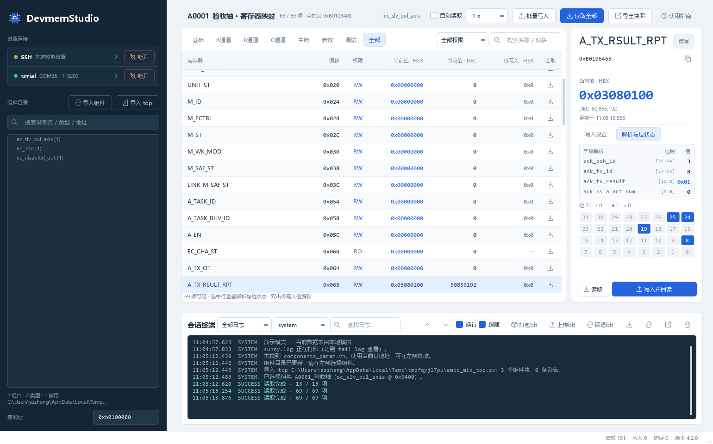
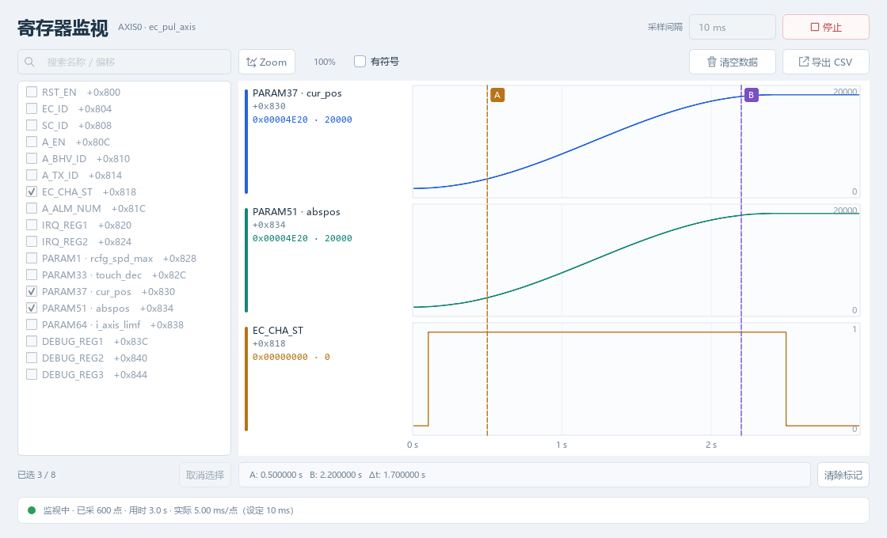
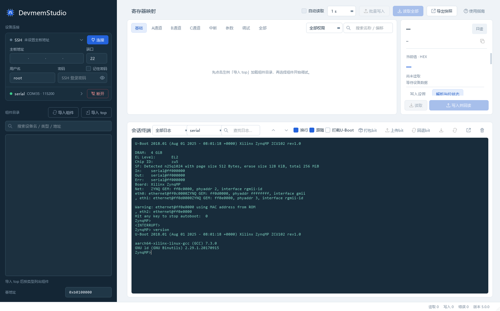
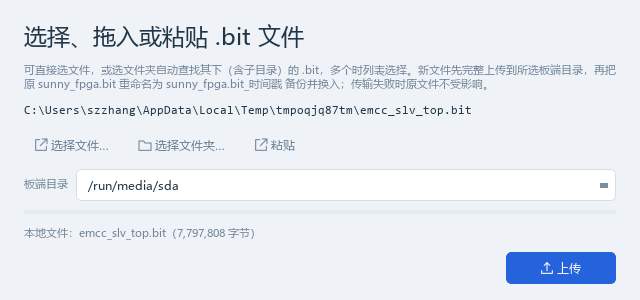
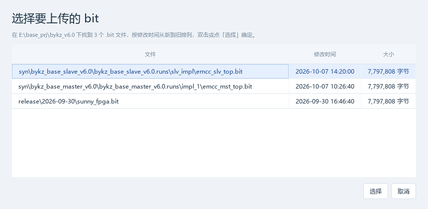
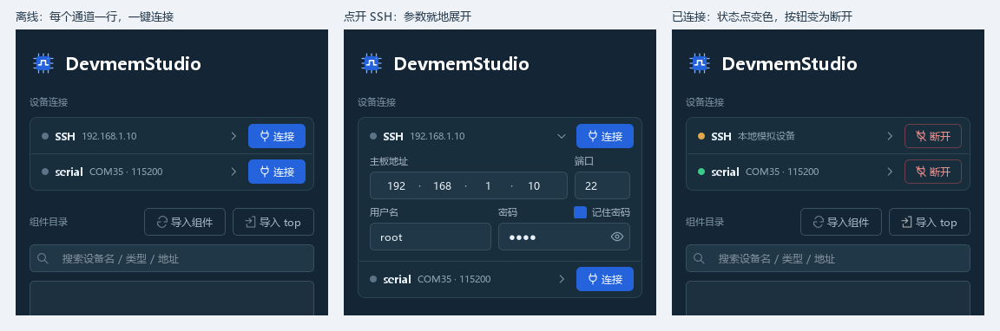
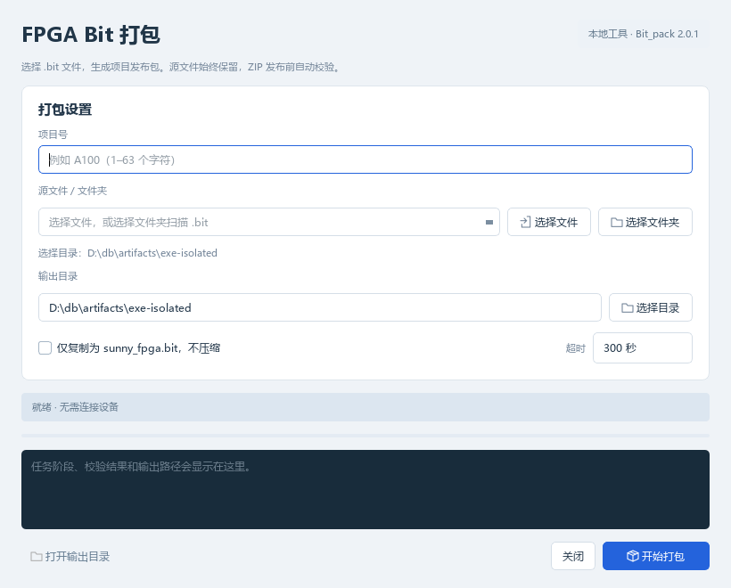
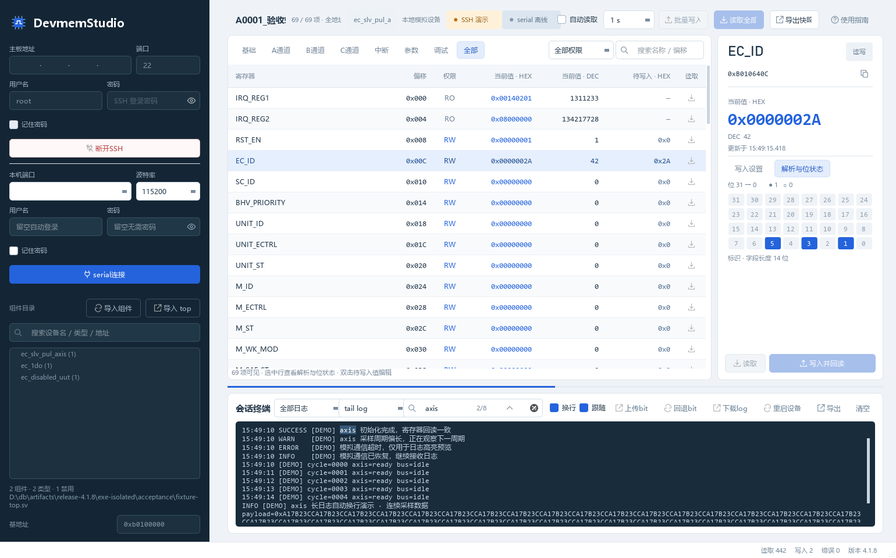
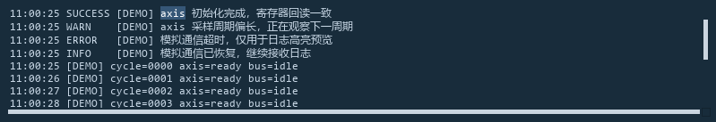
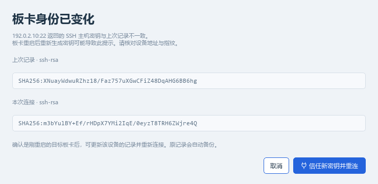

# 寄存器调试工作台 5.3.0

Auth：szzhang / cgliu / bxli

面向 FPGA / ARM 的 EMCC60 主板的寄存器调试工作台。以控件为中心：导入 RTL 顶层文件后直接选择组件调试，寄存器表精确到组件类型。

<div align="center">



</div>

当前发布包：**`DevmemStudio-5.3.0-win64.zip`**，内含单文件 `DevmemStudio/DevmemStudio.exe`。应用版本和 Windows 文件/产品版本均为 **5.3.0**。5.2.0 起加入 GitHub 在线升级，使用和发布步骤见 [在线升级说明](docs/GITHUB_UPDATES.md)，构建结果及联网验证边界见 [5.3.0 验收记录](docs/VALIDATION_5.3.0.md)。

<div align="center">

| 需要做什么 | 阅读位置 |
| --- | --- |
| 下载后的运行与升级 | [直接运行 EXE](#直接运行-exe) |
| 连接板卡、导入 top、调试寄存器 | [使用流程](#使用流程) |
| 查看本次变化 | [5.3.0 发布](#530-发布2026-10-10) |
| 找配置、缓存或日志 | [配置与日志](#配置与日志) |
| 开发、测试与生成发布包 | [使用当前 venv 开发](#使用当前-venv-开发)、[重新打包](#重新打包) |
| 排查启动、监视或构建问题 | [常见问题](#常见问题) |

</div>

## 5.3.0 发布（2026-10-10）

- 寄存器监视窗口「导出数据」可把保留的全部采样点导出为 **无损压缩 ZIP**（内含同名 CSV，Windows 自带解压即可打开）或普通 **CSV**，默认 ZIP。
- 主工作台的「导出快照」同样支持 ZIP 无损压缩与普通 CSV 两种格式，默认 ZIP。
- ZIP 解压后的 CSV 与普通 CSV 逐字节一致，保留全部导出行、列、中文、数值、有符号显示选择和读取失败的空值；只导出保留部分，监视缓存超限时已丢弃的旧数据不包含在内。
- 导出按文件名扩展名识别格式，未填写扩展名时按所选类型补齐；先写临时文件、成功后再替换目标文件，导出失败不会覆盖已有文件。

## 5.2.9 发布（2026-10-09）

- 开始监视后点击图表放置 A/B 标记，不再打断后续采样刷新，曲线不会停在点击那一帧。
- 子窗口最大化后，点击主窗口或任务栏可以把主窗口提到前面。子窗口保持最大化，再点它的任务栏按钮即可回到子窗口。

## 5.2.8 发布（2026-10-09）

- 寄存器监视最多 32 个寄存器。曲线较多时滚轮上下浏览，点击左侧寄存器定位对应曲线；只绘制当前可见曲线。开始监视后滚动不再因采样重绘而滞后。
- 时间轴固定在图表可视区域底部，曲线再多也能看到，并随新采样更新。鼠标时间显示在这条时间轴上。
- A/B 标记按当前画面上的点击位置放置。监视进行中新采样到来时，标记线不再偏到点击位置旁边。点 A/B 标签只选中该标记。
- 每条曲线左侧表头显示名称和地址，并固定显示 `N`（最新值）、`S`（鼠标读数）、A、B。未设置时显示「—」。A/B 标签只在可见图表顶部显示一组，随纵向滚动保持在顶部。图表不弹出使用说明气泡。
- 串口连接时「重启设备」通过串口发送 `reboot` 并保持连接以接收启动日志。SSH 与串口同时在线时，按终端来源选择通道，确认框写明发送通道。
- 子窗口最小化到任务栏，不再留下桌面小框。主窗口最小化时隐藏子窗口，恢复时保留各窗口原来的普通、最大化、最小化状态和位置。

## 5.2.7 发布（2026-10-09）

- 修复首次选择组件时，“自动读取”左侧组件类型名称偶发显示不全：标签宽度按完整名称稳定计算，去掉与样式内边距叠加的默认缩进。
- 寄存器标题栏空间不足时先收起操作按钮文字，优先完整显示组件标题和类型名称；仅在收起后仍不足时省略名称，悬停可查看全文。

## 5.2.6 发布（2026-10-08）

- 寄存器监视的勾选按组件类型记忆：在某个组件上勾选后，打开同类型的其他实例（如另一个 `ec_slv_pul_axis`）会按相同偏移自动勾选；该实例自己改过勾选后以它自己的为准。只打开、不改勾选不再写入记忆。
- README 中的图片和表格居中显示。

## 5.2.5 发布（2026-10-08）

- 更新窗口标题栏加入最小化（及最大化）按钮；最小化后再点“检查更新”或自动检查发现新版时，窗口会恢复显示。

## 5.2.3 发布（2026-10-08）

- 更新窗口点击“取消”或关闭窗口立即生效，不再等卡住的网络请求超时；取消后可马上重新检查。
- 升级后的旧版备份改名为 `DevmemStudio-<旧版本>-backup.exe`，双击即可运行旧版。原来的 `.bak` 会被公司透明加密，改回 `.exe` 也无法运行。从 5.2.2 升到本版时仍按旧规则生成 `.bak`，之后的升级才使用新名称。

## 5.2.2 发布（2026-10-08）

功能与 5.2.1 相同，用于验证从 5.2.1 在线升级的完整流程。

## 5.2.1 发布（2026-10-08）

5.2.0 未在 GitHub 发布，本版是在线升级功能的首个公开版本。

- 状态栏“检查更新”紧跟版本号显示，字体与基线一致；悬停变色提示可点击。
- 更新窗口重排：当前版本 / 最新版本 / 更新包大小一览，更新说明按 Markdown 显示，下载进度只在下载时出现；主按钮随状态切换“检查更新 → 下载更新 → 重启并升级”。
- GitHub 匿名 API 达到访问上限（每 IP 每小时 60 次，公司网络多人共享）时，改从发布页跳转获取最新版本，用 `.sha256` 文件校验后照常升级。
- 网络连接偶发中断时自动重试 3 次；修正升级工具在 PowerShell 5.1 下可能读不到新版退出码而误回滚的问题。

## 5.2.0 发布（2026-10-08）

- 底部新增“检查更新”，通过 `shiknevus/devmemstudio` 的 GitHub Releases 检查正式版；启动 5 秒后在后台检查，可在更新窗口关闭自动检查。网络失败仅记录提示，可重试或打开发布页手动下载。
- 展示更新说明、下载进度，支持取消；更新包必须通过 SHA-256 校验才能安装。
- 点击“重启升级”后保存设置、停止监视并断开设备，独立更新进程等待应用与外层启动器退出，只替换用户启动的 EXE，保留原文件备份。替换失败保留旧程序；新版在启动后 3 秒内以非零状态退出时尝试恢复并重启旧版。
- HTTPS 依赖和 Windows 更新脚本已打包；构建同时生成 ZIP 的 `.sha256` 校验文件。源码模式可检查、下载，安装需使用单文件发布版。
- 5.1.0 及更早版本需先手动换入本版 EXE，之后才能使用在线升级。详细发布步骤与限制见 [在线升级说明](docs/GITHUB_UPDATES.md)。

## 5.1.0 发布（2026-10-08）

**监视列表与曲线联动 · 运行库并行压缩与解压 · 构建和测试提速**

### 监视列表与曲线联动

监视窗口现在可以从列表或图表定位同一个寄存器：点击左侧寄存器行，高亮该行和对应曲线区域；点击图表左侧的寄存器名称，反向高亮列表条目，并在条目未被搜索隐藏时滚动定位。

1. 导入 top 并选中组件，点击寄存器区的「监视」。
2. 在左侧搜索并勾选要观察的寄存器，最多 32 个；设置采样间隔，最小 5 ms，默认 10 ms。
3. 点击「开始监视」，每个寄存器显示一条曲线，共用时间轴；曲线较多时用滚轮上下浏览。运行期间可点击列表定位对应曲线，或点击图表左侧名称切换高亮，采样勾选保持不变。鼠标移动时显示跟随线和悬浮数值，左侧表头常驻显示 `N/S/A/B`，分别为最新值、鼠标值及 A/B 标记值（十六进制和十进制）；图表不弹出使用说明气泡。
4. 在曲线区域单击依次放置 A/B 标记，拖动调整位置；图表下方显示两个时刻及 Δt。点击左侧名称只切换高亮，不放置标记。
5. 按 Ctrl + 滚轮以鼠标位置为中心缩放时间轴，范围 25%–6400%；点击 Zoom 恢复全局视图。开启「有符号」后按 32 位补码显示数值。
6. 点击「清空数据」清除采样点和标记，保留当前高亮；点击「导出数据」导出当前保留的数据，默认使用 ZIP 无损压缩，也可选择普通 CSV。停止监视后可继续检查曲线。

未参与采样的寄存器只高亮列表行。搜索隐藏的条目不会因点击曲线名称自动取消搜索。只写、读清零或读取有副作用的寄存器不能加入持续监视。每次运行最多保留 20 万点，超过时丢弃最旧的 1/4 并提示；ZIP 和 CSV 都只包含保留部分。勾选按 top + 组件记忆，间隔与有符号选项保存在 `registers.json`。

### 寄存器数据无损压缩导出

监视窗口「导出数据」和主工作台「导出快照」均提供两种文件类型：默认的 **无损压缩 CSV (`.zip`)** 和普通 **CSV (`.csv`)**。ZIP 内含一个同名 CSV，使用 Windows 自带的「全部解压缩」后即可用 Excel 或其他 CSV 工具打开，无需安装额外软件。

ZIP 解压后的 CSV 与普通 CSV 导出逐字节一致，保留全部导出行、列、中文、数值、有符号显示选择和读取失败的空值；沿用原 CSV 的时间与数值格式，不做抽点或额外舍入。数据重复越多，压缩通常越有效，实际大小取决于数据内容。此处的无损指压缩不改变 CSV 内容，无法恢复监视缓存超限时已丢弃的旧数据。

文件名明确以 `.zip` 或 `.csv` 结尾时按扩展名导出；未填写扩展名时按所选类型补齐。导出先写入临时文件，成功后再替换目标文件，写入失败不会覆盖已有文件。

### 单文件运行库与启动

单文件 EXE 继续内嵌 Python、Qt 和 SSH 依赖。运行库改为 **3 个独立的 LZMS 压缩块**：构建时并行压缩，首次启动或缓存需要修复时并行解压，使用 Windows 自带的解压接口。完整运行库仍通过 SHA-256 校验，再写入临时目录并原子发布。

运行库缓存位于 `%LOCALAPPDATA%\DevmemStudio\runtime\<版本-内容哈希>\`；正常后续启动复用缓存，文件缺失或损坏时自动修复，不再使用的旧版本缓存自动清理。程序的连接设置仍在 EXE 旁的 `registers.json`，不可写时回落到用户目录。升级时保留原设置文件即可，发布 ZIP 不包含本机设置、密码或日志。

### 构建、测试与导入优化

- `build_exe.bat` 统一调用 `tools/build.py`。全量测试、源码离线验收、EXE 构建与隔离验收并行执行；这些检查全部通过后才将候选 EXE 发布到 `dist`。
- 固定依赖版本已一致、图标已是最新时跳过对应生成步骤；运行库内容未变时复用压缩缓存。PyInstaller 阶段固定时间戳与哈希种子，减少无内容变化引起的重复压缩。
- `tools/run_tests.py` 在独立子进程中并行执行测试，按上次用时分块；界面用例去重、模拟读取取消人为等待，SSH 文件测试使用独立临时目录。正式构建使用 `--full`，包含完整 SSH 依赖裁剪检查。
- 查找 `components_param.vh` 时减少重复目录遍历，仍按原有顺序查找顶层附近与祖先目录下的参数文件。
- 演示会话对象回收时自动清理临时模拟板端目录。

本次完整构建约 75 秒：全量回归执行 363 项，360 项通过、3 项依赖 POSIX sh 在 Windows 上跳过；源码离线验收及两轮独立 EXE 验收各 111 项检查通过。具体环境、产物大小与 SHA-256 见 [5.1.0 验收记录](docs/VALIDATION_5.1.0.md)。

构建命令、阶段日志、候选 EXE 验收及常见问题见下文。本次未新增实板验证；常驻采样程序的板端 CPU 占用与实际采样周期仍需在目标设备上测量。

## 当前流程：选组件 · 切视图

- 界面不再有「模块目录」和「基地址 + 组件地址」栏：**左侧「导入 top」→ 组件目录（按类型分组、可搜索）→ 点击组件**即锁定其 `REG_SPACE_BIAS` 地址并加载该类型的精确寄存器表。标题行显示设备名、类型徽标、全地址；基地址自动取自 `components_param.vh`（找不到时左侧出现可编辑的基地址框）。
- 寄存器区新增八个**视图页签**，按 RTL 实测语义切分该组件的寄存器：
  - **基础**：`RST_EN`（写 1 运行 / 0 复位保持）、`EC_ID/SC_ID/BHV_PRIORITY`（仲裁序 0:abc…5:cba）、`UNIT_*/M_*/M_WK_MOD`（=3 手动模式拒绝 A 通道行为）、`M_SAF_ST/LINK_M_SAF_ST`
  - **A通道 / B通道 / C通道**：三个通道各自独立一页。每页含该通道的 `X_EN`（门控，A 复位默认开、C 默认关）、`X_BHV_ID`（行为触发，**预设直接来自 RTL 的行为表注释**，如 home/jog/move[jog[safe]）、`X_TX_OT`（超时，单位秒）、`EC_CHx_ST`（通道忙）、`X_TX_ID`（10/20/30/40 事务）、`X_ALM_NUM`（100 预检超时…106 强制停止…110 手动模式）；A 通道另含 `A_TASK_ID/A_TASK_BHV_ID`，C 通道另含 `C_GAP_CRL`（心跳周期 ms，0 关）
  - **中断**：`IRQ_REG1`（ec_id[31:18]/sc_id[17:8]/bhv_id[7:0]）、`IRQ_REG2`（tx_id/alm_num，锁存不自动清）**及 A/B/C `X_TX_RSULT_RPT` 上报应答**（PS 写 `{beh,tx,0x51/0x52,alm}` 应答中断）
  - **参数**：该类型实现的 PARAM 子集，**每个参数都带标注**——有接线的显示实际信号名（`PARAM1 · rcfg_spd_max`、`PARAM64 · i_axis_limf`，来自 RTL 端口连接、assign、拼接表达式与端口注释收割）；顶层例化中被注释的标 `未接线`（读回值无意义）；只接空线、组件内未使用的标 `预留`。悬停另显示 RTL 注释与状态说明
  - **调试**：`DEBUG_REG1/2/3` = A/B/C 行为状态机历史，每字节一个状态（**四拍字段解码**：前第3拍/前第2拍/前第1拍/当前；状态 0 空闲 1 预检 2 发IRQ10 … 12/13 结束）；例外自动标注（dv300_do REG3=输出脚快照、2di_2do REG2=IRQ 边沿计数）
  - **全部**：完整精确表
- 读取全部 / 轮询 / 批量写入只作用于当前视图；视图只是过滤，切换不丢已读值和写入草稿。参数信号名参与搜索与 CSV 快照。权限过滤改为下拉（全部/只读/可读写）；未实现寄存器不出现在表里（`BHV_EN` 等读取返回 0x7FFFFFFF 的已剔除）。

### top 组件解析与精确寄存器表

- 导入 top 按 `ec_` 实例解析全部控件（设备名/类型/地址/禁用态）。有 `flow_comp` 头时用头上的名称和编号；没有头、或同一个头下面还有别的 `ec_` 实例，也会收进来。重启自动重载；类型无精确表时回退通用表并标 `≈`。
- 寄存器表由 `tools/gen_component_catalog.py` 从 `reg_addr_pl.vh` + 各 `ps_rw_pl_reg_*.sv` 生成（含 PARAM 注释与行为表收割），打包于 `devmem_studio/data/component_catalog.json`；RTL 变更后重跑脚本刷新。

### 运行时导入组件（RTL 改动后免重新打包）

某个组件**内部**修改后，在发布版 EXE 里点「导入组件」，选择该组件的文件夹（如 `...\pl_exe_io\ec_dv300_do\`，需含 `ps_rw_pl_reg_*.sv`，可选同级 `ec_*.sv`；寄存器地址表从上级 `include_files/reg_addr_pl.vh` 向上查找）：

- 解析出的寄存器表/信号名/行为表/DEBUG 语义**立即覆盖**内置定义并作用于该类型组件（正在查看的组件自动刷新）
- 定义持久化到 `%LOCALAPPDATA%\DevmemStudio\component_overrides\<类型>.json`，重启自动加载；删除该文件即恢复内置定义
- 与生成器同源（`devmem_studio/component_parse.py`），两端解析结果一致

## 5.0.0 更新（2026-10-08）

**寄存器监视 · 板端常驻采样 · 工具栏精简**

<div align="center">



</div>

### 寄存器监视：数值随时间变化的曲线

- 寄存器区筛选栏新增「监视」：打开监视窗口，左侧列出当前组件的寄存器（可搜索名称/偏移），最多勾选 **32 个**，点「开始监视」后在板端按采样间隔（**最小 5 ms**，默认 10 ms）连续采样，每个寄存器一条曲线，共用时间轴。勾选结果按 top + 组件分别记忆，未勾选过的组件沿用同类型组件最近一次的勾选（按偏移，5.2.6 起），采样间隔与「有符号」设置保存在 `registers.json`。
- 窗口布局：标题行右侧是「采样间隔」和「开始监视/停止」；图表上方左侧是 Zoom、缩放比例、有符号，右侧是「清空数据」「导出 CSV」；图表下方是 A/B 标记读数与「清除标记」；底部状态栏用圆点表示状态（灰=未运行、蓝=启动中、绿=监视中、黄=提示、红=错误），并显示已采点数、用时、实际采样周期、读取失败次数和采样方式。
- 图表操作：悬停显示该时刻各寄存器的值；单击依次放置 A/B 标记，读数显示两点时间与 Δt，可拖动标记，右键清除；Ctrl + 滚轮以鼠标位置为中心缩放时间轴（25%–6400%），点 Zoom 恢复全局。读取失败的点在时间轴上标红色刻度。
- 只写寄存器不能勾选。每次运行最多保留 20 万点，超出时丢弃最旧的 1/4，状态栏会提示，导出 CSV 只含保留部分。
- 采样方式：aarch64 板子使用内置的常驻采样程序 `regmon`（约 4 KB 静态程序，不依赖 libc；首次使用时经 SFTP 放到板端 `/tmp/devmem-studio-regmon-<哈希>`，每次开始前校验 SHA-256），一次映射 `/dev/mem` 后循环读取，CPU 占用很低；程序无法放置或无法执行（如 `/tmp` 为 noexec）时自动改用 `devmem` 循环（板端 CPU 占用较高，状态栏会注明）。寄存器访问故障或 `/dev/mem` 打不开时停止监视并提示原因。
- 网络卡顿时暂停而不是停止：超过 max(2 s, 3×间隔 + 0.5 s) 没有新数据，状态栏显示「数据暂停 N s」，恢复后自动继续；板端跟不上设定间隔时按实际速度采样并提示。

### 工具栏与导入

- 「导入 top」改为直接选择文件夹，自动查找其中（含子目录）包含 `ec_` 控件的 top，找到多个时列表选择。
- 会话终端工具栏去掉日志级别筛选下拉框（各来源始终显示全部记录）；「拦截U-Boot」复选框改名为「U-Boot」，功能不变。
- 会话终端工具栏与监视窗口的次要按钮统一为带边框样式。
- 版本号保持 **5.0.0**，发布包仍为 `DevmemStudio-5.0.0-win64.zip`；本次构建验收结果见 [5.0.0 验收记录](docs/VALIDATION_5.0.0.md)。

## 5.0.0 发布（2026-10-07）

**串口终端重做 · 进 U-Boot · 文件夹选择 · 板端目录可选可记忆**

<div align="center">



</div>

### 串口终端：板卡输出实时显示，按键直发

- 串口连接后，终端自动切到 `serial` 来源，**板卡自发的打印（启动日志、内核消息、U-Boot）实时显示**，不再只在执行命令时才看到回复。
- serial 视图改为字符模式控制台：每个按键立即发给板卡，回显由板端负责。Tab 补全、`↑`/`↓` 历史、行内编辑都由板端 shell 处理，超过 80 列的长命令换行、跨行退格显示正确（按实板 readline 输出验证）。无选中文字时 Ctrl+C 发送中断，有选中时复制；Ctrl+V 粘贴发送。
- **进 U-Boot**：倒计时期间在终端里按住 Shift+7；或先勾选工具栏「拦截U-Boot」，再点「重启设备」或给板卡上电，软件在 `Hit any key to stop autoboot` 出现时自动按住 `&`，停在 `ZynqMP>` 后清掉多余字符并提示，输入 `boot` 回车继续启动。实板验证：该板 U-Boot 不响应单次按键，需要连续按键，「拦截U-Boot」一次成功。
- 连接时不再向板卡发送任何字符，不会误打断 U-Boot 倒计时。填写了串口用户名/密码时，出现 `login:` 提示后自动登录，密码错误只提示一次、不反复重试；`passwd`、`su` 等其他密码提示不会被自动填写。
- **串口线拔出立即检测**：收发线程读口失败即断开并在终端和 system 日志提示；Windows 设备插拔通知也会立即刷新串口列表（插上新串口自动出现）。串口被其他工具占用时提示「被占用」。

### 跟随、文件夹选择与板端目录

- 会话终端勾选「跟随」立即跳到最新输出。
- 「上传bit」新增「选择文件夹…」，也可把文件夹拖进窗口：在该文件夹及子目录中查找 `.bit`（跳过 `.Xil` 等隐藏目录），只有一个时直接选中，多个时列表按修改时间从新到旧排列供选择。
- 「导入 top」改为菜单：「选择 top 文件…」或「选择文件夹，自动查找 top…」；文件夹中按控件数量列出包含 `ec_` 控件的 `.sv/.v` 文件供选择。
- 「上传bit」「回退bit」的板端目录改为下拉框：默认 `/run/media/sda`，打开时自动列出板端 `/run/media` 下的挂载目录，也可直接输入；**记住上次使用的目录**（保存于 `registers.json`），两个窗口共用。上传确认框显示目标位置。

<div align="center">



</div>

<div align="center">



</div>

- 应用版本与 Windows 文件/产品版本同步更新为 **5.0.0**。发布包为 `DevmemStudio-5.0.0-win64.zip`，内含单文件 `DevmemStudio.exe`。
- 本版本测试、实板验证、构建与独立运行验收结果见 [5.0.0 验收记录](docs/VALIDATION_5.0.0.md)。

## 4.2.2 发布（2026-10-07）

- 打包弹窗的「仅复制为 sunny_fpga.bit，不压缩」勾选状态随项目号、目录一起记忆于 `bitpack_settings`，软件重启后恢复；勾选时保留已填项目号，取消勾选即可继续使用。
- 应用版本与 Windows 文件/产品版本同步更新为 **4.2.2**。发布包为 `DevmemStudio-4.2.2-win64.zip`，内含单文件 `DevmemStudio.exe`。
- 本版本测试、构建与独立运行验收结果见 [4.2.2 验收记录](docs/VALIDATION_4.2.2.md)。

## 4.2.1 发布（2026-10-07）

- 修复 SSH 与 serial 连接设置中两个「记住密码」复选框底部被裁切的问题：标题行按控件实际尺寸自动布局，在 100%、125%、150%、200% 缩放下完整显示，用户名与密码输入框保持对齐。
- 应用版本与 Windows 文件/产品版本同步更新为 **4.2.1**。发布包为 `DevmemStudio-4.2.1-win64.zip`，内含单文件 `DevmemStudio.exe`。
- 本版本测试、构建与独立运行验收结果见 [4.2.1 验收记录](docs/VALIDATION_4.2.1.md)。

## 4.2.0 发布（2026-10-07）

**连接卡片重做 · 单文件更小更快 · 集成打包工具 · 单行响应式工具栏**

### 连接卡片：每个通道一行，一键连接

<div align="center">



</div>

- 左栏「设备连接」改为一张卡片，**SSH 与 serial 各占一行**：状态圆点（灰＝离线、蓝＝连接中、绿＝已连接、橙＝演示）＋通道名＋连接目标摘要（如 `192.168.1.10`、`COM35 · 115200`）＋右侧「连接 / 断开 / 取消」按钮。已保存过参数时，打开软件直接点该行的「连接」即可，不必展开表单。
- 点击通道行展开参数，**一次只展开一个通道**（手风琴式），另一行自动收起，组件目录始终保留足够高度；连接成功后该通道自动收起，连接失败（非用户取消）自动展开以便修改参数；主板地址或用户名为空、或未选择串口时点「连接」，会展开对应通道并定位到待填项。首次使用（未填主板地址）默认展开 SSH。
- 参数区更紧凑：「记住密码」移到密码标题右侧，不再单独占一行；串口下拉、波特率、复选框统一为侧栏深色样式；串口列表以 `COM35 · 设备描述` 显示，端口号在前，过长时省略号截断、展开列表可看全名；未接串口时摘要显示「未检测到串口」。
- 在任一参数输入框中按 **Enter** 即连接该通道；Esc 仍可取消正在进行的连接。
- 小窗口不再弹出独立的「连接设置」对话框：卡片收起后只占两行，直接在左栏操作。连接状态统一在卡片上显示，寄存器标题行去掉了重复的 SSH / serial 徽章和会话摘要，组件标题与类型徽标在常规窗口下完整显示（同时修复类型徽标在空间足够时仍被省略的问题）。

### 集成打包工具与响应式工具栏

- 会话终端新增「打包bit」（「上传bit」左侧），打开与工作台共用配色、字体、卡片、输入框和蓝色主按钮的 **PySide6 打包弹窗**。Bit_pack 2.0.1 仅作为后台 CLI 引擎，不显示原生窗口或控制台；无需连接设备，寄存器任务也不影响本地打包。
- 支持「选择文件」与「选择文件夹」：选择/拖入文件夹后，在后台递归扫描 `.bit`，从下拉列表选择要打包的文件（包含子目录，跳过目录联接和符号链接）。也可直接选择、粘贴或拖入 `.bit`。填写项目号与输出目录，生成 `项目号_bit_yyyyMMddHHmmss.zip`，ZIP 根目录只有 `sunny_fpga.bit`；也可勾选仅复制。沿用原引擎的源文件保留、快照、防重名、内容校验、超时与安全清理。
- **项目号、仅复制勾选状态、上次选择目录（文件/文件夹）、输出目录及所选文件自动记忆**，保存于工作台 `registers.json` 的 `bitpack_settings`；软件重启后恢复。勾选或取消“仅复制”都会记忆，勾选时仍保留项目号。曾选择文件夹时重新扫描并恢复上次选中的文件，已记忆的输出目录不会被新源文件自动覆盖。
- 任务阶段实时显示。复制已有 `sunny_fpga.bit` 前须确认；取消或关闭弹窗/工作台时，通过每个任务独立的 Windows 命名事件请求取消，**等待引擎清理完毕后关闭**，不直接杀死打包进程。重复点击复用弹窗并保留已填写的字段。
- 打包按钮与日志搜索、筛选等保持 **同一行**，不拆为两行。空间不足时次要按钮显示图标，极小窗口下 bit 操作也切换为图标；寄存器工具栏与窄侧栏的导入按钮同样响应可用宽度；悬停与无障碍名称始终保留完整说明。窗口变宽后恢复文字。
- 紧凑模式日志筛选显示「全部 / 错误 / 命令」，来源显示「log / ssh / serial / sys」，完整名称可在悬停中查看；长设备名、组件类型和连接目标以省略号显示但保留原始文本与完整提示。搜索箭头隐藏时仍可用 Enter / Shift+Enter 跳到下一个/上一个匹配。
- **小窗口左栏固定为 300 px**，连接卡片两个通道均收起，组件目录树占据主要空间；左栏不再是滚动区，只有目录树自身滚动，避免嵌套上下滚动条；放大窗口后恢复 360 px 可拖动左栏。组件目录树与连接卡片、搜索框始终同宽（修复小窗口启动后放大、或左栏拖到最窄时目录树向右多出一截）。
- 寄存器标题行**优先完整显示组件标题**：去掉标题 240 px / 类型徽标 180 px 的固定上限，最大化或常规窗口下长设备名（如 `ec_superisys_485_modbus_rtu_27`）不再被截断；空间不足时依次让出：类型徽标缩到约 90 px → 读取全部 / 批量写入 / 导出快照 / 使用指南改为图标 → 最后才省略标题末尾（悬停可见全文）。
- 寄存器区筛选栏（视图页签 + 权限选择 + 搜索框）按**自身实际宽度**自动选择四档排布：完整 → 权限缩写「全部 / 只读 / 读写」、搜索框收窄 → 页签收紧间距 → 页签缩写为「基 / A / B / C / IRQ …」。拖动左栏或检查器分隔条同样生效，权限选择与搜索框不再重叠或被截断。
- 其他选择框按可用宽度压缩：轮询预设省去空格，位宽/进制选择框收窄；完整说明放在悬停提示中。显示压缩不改变实际访问位宽、进制或正在输入的轮询草稿。
- 图标语义区分：**导入 top＝箭头进入文件；上传 bit＝向上箭头；下载 log＝向下箭头；打包 bit＝包裹**。
- 打包引擎与说明随单文件 EXE 一同分发，不依赖 `D:\bitfile` 或本机 Python。引擎按内容哈希原子释放到 `%LOCALAPPDATA%\DevmemStudio\tools\bitpack\<SHA256>\pack_bit.exe`。弹窗优先恢复上次选择与输出目录；首次使用时选择目录取已导入 top 的所在目录（无 top 时取工作台目录），未指定的输出目录自动跟随源文件。

<div align="center">



</div>

### 单文件发布：更小、启动更快

发布物仍是**一个** `DevmemStudio.exe`，复制这一个文件即可使用，无需 `_internal/`、Python 或任何安装。

<div align="center">

| 指标 | 4.1.8 单文件 | 4.2.0 单文件 |
|---|---:|---:|
| EXE 体积 | 31.5 MB | **19.6 MB**（-38%） |
| 日常启动（中位数） | 3.09 秒（每次都解压） | **0.75 秒**（-76%） |
| 新版本首次启动 | 3.27 秒 | 3.50 秒（仅一次，含解压与杀毒扫描） |

</div>

同一台机器、同一时段交替实测，每个版本 2 轮 × 5 次，计时到主窗口可响应。

- **原理**：外层是一个约 140 KB 的原生启动器，内嵌用 Windows 自带 LZMS 算法压缩的运行库（不额外携带解压器）。每个版本只在首次启动时解压一次到 `%LOCALAPPDATA%\DevmemStudio\runtime\<版本-内容哈希>\`，之后每次启动只核对文件大小与时间戳后直接运行，省去旧单文件版每次启动都要解压几十 MB 的开销。首次启动的解压本身不到 1 秒，其余主要是杀毒软件扫描新释放的 DLL，一次性完成。
- **安全与自愈**：解压前校验整个运行库的 SHA-256；先写入临时目录，完整后再原子改名生效，中途断电或被杀不会留下半成品；缓存文件被改动、缺失或损坏时自动重新解压；运行期间缓存文件以只读共享方式锁定。同时打开多个实例互不干扰。
- **自动清理**：升级后，旧版本缓存在不被任何实例使用时自动删除（正在运行的旧版本不受影响）。
- **设置位置不变**：`registers.json` 仍保存在 EXE 旁边（不可写时回落到 `%LOCALAPPDATA%\DevmemStudio\`），沿用旧版设置只需把原 `registers.json` 放到新 EXE 旁。发布包不含本机 `registers.json`、设备密码或日志。
- **任务栏固定**：窗口属于缓存中的运行库进程，4.2.0 为窗口设置了应用标识与重新启动命令，固定到任务栏后再次点击启动的是外层 EXE，而不是缓存路径。
- **启动更轻**：SSH 库（paramiko / cryptography）改为窗口出现后在后台预加载，首次连接无需等待；剔除未使用的 `invoke`、OpenSSL 版 hashlib（含 5.2 MB 的 `libcrypto-3.dll`，摘要算法由 Python 内置实现提供）、随包 UCRT 副本、Qt 翻译与多余平台插件。完整 SSH 回环测试在相同剔除条件下全部通过。
- 测量方法与原始数据见 `docs/startup-performance.md`。

## 4.1.8 发布（2026-10-06）

**安全性与可靠性修复**

- **RTL 地址解析**：基地址不再取到注释中的旧定义或名称相似的其它宏，支持大写 `'H`。`REG_SPACE_BIAS` 必须是完整数字常量；无法解析的表达式或非法常量会跳过并警告，不再截断成错误地址或中断整份 top 导入。
- **下载文件保护**：SSH/SFTP 与离线下载先写同目录临时文件，完成后再替换目标文件。连接中断、进度回调失败或本地替换失败时保留原文件，并清理半成品。
- **串口登录**：处理打开时已停在 `Password:`、延迟到达的 `login:` 和等待密码时断线等场景；检测到登录提示后必须完成握手，不再误报控制台就绪。
- **配置恢复与密码保存**：非字符串地址恢复默认值，避免启动时文本控件异常；密码记忆标志只接受显式 JSON `true`，字符串 `"false"` 等异常值不再导致密码被保存或加载。保留旧 SSH 配置的迁移兼容性。
- **组件表容错**：校验寄存器名称、位宽、偏移、预设、位域与行为元数据；过滤损坏条目，全无效的覆盖表不再遮蔽正常内置定义。内置 57 个类型、2612 个寄存器定义保持不变。
- **离线模拟校验**：静默/批量读写也执行地址、对齐、位宽和数值范围校验，非法写入不修改模拟内存，防止离线验收假通过。

新增 23 项缺陷回归用例。问题复现、修复与验证边界见 [缺陷排查记录](docs/BUG_AUDIT_2026-10-06.md)，本版本构建及验收结果见 [验收记录](docs/VALIDATION.md)。

## 4.1.7 发布

**导入 top**

- 控件按 `ec_` 实例解析，不再只认 `flow_comp` 头。`emcc_mix_top(7).sv` 这类文件里，头前面的 `ec_superisys_485_modbus_rtu` 和头下面的 `ec_5di` 都会出现在组件目录。
- 有头的块仍用头上的名称、编号；整段被注释的仍标为禁用。同一个头下面还有第二个 `ec_` 实例时，不会被第一个挤掉。
- 文件里一个 `ec_` 控件都没有时，提示「未找到 ec_ 控件」。

## 4.1.6 发布

**会话终端**

- 提示行可以在行内编辑：`←`/`→` 移动光标，Home / End、Delete、Ctrl+Backspace 删词。光标停在历史区时再输入，自动回到提示行末尾。PageUp / PageDown 只滚动历史，不移动光标。`❯` 提示符不能被删掉。
- Tab 补全当前光标所在的单词，后面已经输入的内容保持不动。命令位置补本机内置命令和历史命令，已连接的 ssh / serial 再查板端 `$PATH` 里的可执行文件；路径位置补板端文件和目录（目录带 `/`）。唯一匹配直接补上（命令后加空格，目录保留 `/`）；多个匹配先补公共前缀，再列出候选（最多 100 条，超出时注明总数）。补全在后台执行，不占用寄存器读写的忙碌锁；继续输入后，迟到的结果丢弃。没有输出的命令（例如空目录里的 `ls`）记一行「（命令无输出）」。

**串口登录**

- 板端 getty 在 `login:` 前保持静默时，连接先发一次回车唤醒登录提示，再按用户名和密码登录。
- 已经停在 `login:` 但没填用户名时立即失败，并提示填写凭据。密码错误（`Login incorrect`）在连接阶段报「用户名或密码错误」，不会当成已经登录的 shell。
- 命令超时并关闭连接时，错误信息附带最后收到的一段输出。
- Esc 可以取消正在进行的串口握手。连接成功后清除取消标志，下一次失败不会被误报成「已取消」。
- COM 口枚举改为约每 5 秒一次，不再每个心跳都扫描。

**界面**

- 窗口限制在当前屏幕的工作区内。分辨率放不下常规最小尺寸时，降低最小尺寸并把窗口收回屏幕内。宽度或高度低于 1400×850 时进入紧凑布局：侧栏、检查器、搜索框收窄，标题行隐藏设备名长句。拖到另一块屏幕或分辨率变化时重新适配。
- 检查器记住上次手动选择的页签。再次选中可写寄存器时回到「写入设置」或「解析与位状态」；只读寄存器临时显示解析页，不改掉这份记忆。
- 待写入默认按 HEX 显示和解释。切换 HEX / DEC 只改变当前文本的解释方式，不再把已填数字换算成另一种进制。旧配置里按 DEC 记住的纯数字，加载时转成 HEX。
- 轮询间隔恢复可编辑（4.1.1 重构时丢失）：可输入 `500`、`0.3`、`150ms`，最快 0.1 s。配置里保存的自定义周期原样恢复。

**稳健性**

- bit 上传：剪贴板或已经失效的路径找不到文件时提示「文件不存在」，不再因读取文件大小失败而退出。
- bit 回退：备份时间戳不是合法日期时，显示板端原始时间戳。
- 「导入组件」覆盖文件里偏移损坏（如 `0xZZ`）的条目会被跳过，寄存器表仍能打开，公共中断头照常补齐。
- 离线演示会话拒绝非法写入值，失败的写入不改内存。

## 4.1.5 发布

- 顶部横幅移除：会话状态（等待提示 + SSH/serial 徽章）并入寄存器区标题行「自动读取」左侧，「使用指南」移至「导出快照」右侧，分区标题与下方卡片边缘对齐。
- 徽章、按钮、下拉框统一 32px 高；离线底色加深（原色与工作区背景几乎同色）、已连接绿底加深、信号中状态新增（serial 连接中）。
- serial 新增「连接中」徽章状态；SSH 连接中状态由统一判断维护，修复并发刷新打回离线、主机密钥等待时卡连接中的问题。
- 侧栏可拖拽调宽（与寄存器/终端分隔条同款 9px 手柄）。
- 寄存器标题行在 1180–1920 宽度下不再重叠：固定控件钉住宽度，标题吃余量，长文本走 tooltip。

### 4.1.5 修订：全面评审修复（2026-09-26）

**板端安全与数据正确性**

- bit 上传改为**先传后换**：新文件先上传为 `sunny_fpga.bit.uploading`，完整传完后才把旧 bit 改名为时间戳备份、再换入新文件。传输中断/失败时板端 `sunny_fpga.bit` 保持原样；换入失败自动恢复旧 bit。原流程先改名再上传，断线会让板子只剩半个 bit。
- 上传/回退中 rename 失败不再被当成"没有旧文件"而吞掉（原先可能无备份覆盖旧 bit）；回退时恢复所选备份失败会把当前 bit 放回原位。
- 上传完成提示显示**真实的备份文件名**（原先用完成时刻现算时间戳，与板端实际文件名不符；板端原无 bit 时明确提示未产生备份）；回退列表无当前版本时计数正确。
- 批量读取：某个 `devmem` 无输出时，下一个寄存器的值不再被吞掉误报失败（按 `__R` 标签切分而非按行）。
- 拼接接线的逐位字段按 RTL **声明位宽**计算：如 `{16'd0, irq_posedge_cnt, irq_negedge_cnt}`（两个 `reg [7:0]`）原先被当成 bit1/bit0，现为 [15:8]/[7:0]；未声明标识符按 Verilog 隐式网线 1 位；参数化位宽不可定时不给错误布局。内置目录中 35 处受影响字段（32 个类型的 DEBUG_REG2、ec_1avi PARAM51、ec_pulmotor_handwheel PARAM51/61）已修正。
- 「待写入 · HEX」单元格直接编辑按 **HEX** 解析（原先按十进制：输入 `20` 实际写入 0x14），允许保留预设名前缀。
- 有符号寄存器按字段位宽做补码（原先非 8/16/32/64 位宽一律按 32 位）。

**界面与连接**

- 上传/回退/读取备份列表进行中关闭窗口，任务结束后正常退出（原先窗口卡在禁用态、只能杀进程）。
- 自动读取期间搜索框、筛选、写入值输入不再被反复禁用，输入焦点不丢失；读写按钮仍按忙碌态锁定。
- 忙碌时在终端输入的命令不再静默丢弃：退回提示行并提示稍后重试。
- 会话终端每条记录前不再多一行空行（缓冲条数不再被空行吃掉一半）。
- Ctrl+F 多行选区只取首行填充（换行符应为 U+2029）；查找日志计数与高亮同为大小写不敏感。
- PARAM4 更新后，按其换算的「实际值 (mm | °)」等行立即刷新。
- 串口：登录等待不再空转占满 CPU；执行命令前清掉残留输出；命令执行中断开串口不再报 `AttributeError`；连接中关闭窗口立即取消握手、成功后也会释放 COM 口；连接前点的取消不会丢失。

**RTL 解析（导入 top / 导入组件 / 目录生成器）**

- 整块注释、且无 `ec_` 名的 flow_comp（如 1363 top 的 EECC30 块）标为禁用，不再作为激活组件、也不再让 `--check` 报 `unmatched_top_types`。
- `/* */` 块注释中的例化视为禁用；行内 `/* */` 不影响同行代码。
- 无 flow_comp 标签的 top：按括号配对解析 `ec_x #(...) inst (`，相邻例化不再串成一个；同行 `ec_a #(` 写法可识别；被 `//` 注释的旧 `REG_SPACE_BIAS` 不再覆盖真实地址。
- 两个激活组件地址相同时给出「寄存器空间重叠」警告。
- UTF-8 BOM 不再吞掉首个 `` `define `` / 首个 flow_comp 标签。
- `` `define `` 支持下划线、大写 `'H`、缩进与非 9 位宽（`9'h1_B4` 原先被解析成 0x001）；`REG_SPACE_BIAS` 支持 `'H`/`'D`/`'sh`/无位宽/纯十进制。
- 解码文件：读分支不再跨 `case` 臂串位宽，支持 `=` 与 `'h` 填充；`i_st_wr_data[0]` 单比特写、同一寄存器分段写取并集、`[0:7]` 升序区间、`wr_task_addr[8:0] ==` 与 `&& vld` 条件均正确识别。
- 注释剥离改为单遍从左到右（`// … /*` 不再误删后续真实代码）。
- 加密/二进制的组件顶层或 mix top 报为 `unparsed_files`，不再把全部 PARAM 误标「未接线」。
- 生成器：多个 `reg_addr_pl.vh` 时确定性选取并警告；解码文件只收 `.sv/.v`（跳过 `.bak`），重名给出警告。

> 内置 `component_catalog.json` 生成于 09-16，与当前 RTL 已有漂移（57 型 vs 55 型），本次只修正了上述字段、未整表重生成；需要时按文末命令重新生成。

## 4.1.1 发布

- 会话终端重构：终端本身即 shell。会话终端顶部来源选择器分为 tail log / ssh / serial / system 四个来源，各来源缓冲完全隔离；切换来源即切换终端内容，默认落在 system、不记忆。
- 终端即 shell：ssh / serial 视图底部有 `❯` 提示行，直接输入命令回车执行，`↑`/`↓` 翻历史；tail log / system 视图只读。
- 串口连接独立于 SSH：两条连接可同时在线、互不干扰；两个连接按钮互不禁用。连接中按钮变红「取消连接」，可随时主动中止（SSH 握手可中断、串口握手可取消）。
- 取消可用后移除超时设置：连接超时固定为 8 秒，不再提供数字调节。
- serial 登录握手超时兜底：检测 login 提示后按固定超时等待密码/prompt，超时抛出「串口登录超时」而非半连接成静默 shell。
- 串口连接期间显示与 SSH 相同的不定进度条。
- 右上角双状态徽章：SSH/serial 各自独立的连接状态（离线/连接中/已连接/演示），圆点等大、徽章定宽防跳动。
- 断开连接按钮变红色断开态。
- 底栏左侧状态栏移除：全部提示并进 system 终端，底栏只留读写错误计数与版本号。
- 查找日志：随输随查、当前/总数匹配计数、选中终端文字 Ctrl+F 自动填充；导出当前终端缓冲区为 `session_YYYYMMDDHHMMSS.log`。
- 连接生命周期消息（连接/断开/错误）路由到 system 终端，会话输出进入 ssh/serial 各自缓冲。

## 4.0.2 更新

### 组件 top 导入解析增强

- 组件标签格式兼容两种写法：`-----标签`（标签紧跟横线，如 `// --- flow_comp_1 -----进料1`）与 `--标签---`（双横线分隔），CRLF / LF 换行均正确解析。
- 按 `ec_*` 解析组件：每个 `flow_comp` 块内取**注释深度最浅**的 `ec_*` 声明作为真实组件类型（0=激活代码，>0=注释）。旧的嵌套参考模板（如 `//    // ec_sp_rfid`）不再干扰，真实例化优先于参考模板，禁用态正确标注。
- 无标签组件不再显示空白：header 未写设备名时自动回退为**实例名**（如 `ec_1di_32`、`ec_s7_plc_134`），目录树、标题、CSV 导出全部一致。
- 识别双重注释（`//    // ec_x`）与混合结构（注释参考 + 激活例化共存于同一块）的 top 文件；块内注释过的过时 `REG_SPACE_BIAS` 不会覆盖真实地址。
- 最后一个组件块以 `endmodule` 为界截断，长文件末尾的组件也能完整解析（原先是固定 200 字符截断）。

### bit 上传校验与确认

- 严格校验 `*.bit` 后缀（大小写不敏感）：选择、粘贴、拖入、点上传四个入口都会拦截，非 bit 文件提示「选中文件不是bit文件」。
- 上传前弹出确认框，显示**文件完整路径与文件日期**（修改时间），确认后才开始备份与上传。

### 脉冲域位置信号按补码显示

- `rserv_target_pulse` / `rserv_step_pulse` 即使端口未声明 `input signed` 也按补码 DEC 显示（负值正确显示为负数，如 `0xFFFFFF9C → -100`），与其它位置/速度寄存器一致显示「实际值 (mm | °)」。

### 其它易用性

- 轮询间隔可编辑输入（最小 0.1 s，即 100 ms），支持 `0.3`、`150ms`、`500` 等写法。
- 选中任意寄存器默认切到「解析与位状态」页签。
- 批量读取合并为单条 shell 命令，会话日志压缩为单行（`读取 N 个寄存器 0x...`），不再逐寄存器刷屏。
- 移除「停止」按钮（保留 Esc 取消与批量操作的立即停止）。

## 4.0.2 发布

- 移除界面左下角侧栏底部的「SSH / LINUX / MMIO」静态标签。
- exe 精简：剔除 Qt6Network / Qt6OpenGL / qdirect2d 等无引用 DLL 与插件，体积 34.1 → 29.8 MB。
- smoke 验收适配 4.0.0 起的寄存器默认 DEC 显示；补全 exe 文件属性版本书写。

## 4.0.1 发布

- 内嵌使用指南补充「回退bit」，操作步骤、快捷键与开发者条目统一编号。
- 排版美化：标题蓝色、正文/代码黑橙分色、字号层级调整。
- README 使用流程精简为 6 步，同步回退 bit 与导入时序说明。

## 4.0.0 发布

- 新增「回退bit」（上传bit 右侧）：列出板端 `/run/media/sda` 下的 `sunny_fpga.bit*` 备份。
- 选择版本后二次确认；回退时当前 bit 备份为 `sunny_fpga.bit_时间戳`，所选版本恢复为 `sunny_fpga.bit`。
- `SshSession` / `DemoSession` 新增 `list_bit_backups()`、`rollback_bit()`（SFTP rename），含单元与 UI 测试。

## 3.3.2 发布

- 有符号参数的补码 DEC 显示：从 RTL 端口声明收割 signed 属性（目录 schema 8），`ec_slv_pul_axis` / `ec_pul_axis` 的 PARAM51（`r_pf_abspos`）自动标记。
- DEC 显示按二进制补码转有符号数：表格列、检查器、CSV 快照三处统一（`0xFFFFFF9C → -100`）；HEX 与位状态不变。

## 3.3.1 发布

- 使用指南末尾新增标准条目「Auth：szzhang / cgliu / bxli」。

## 3.3.0 发布

- 拼接型参数接线（如 `param52 = {30'd0, b_reset, param16[0]}`）解析出每根信号线及其位位置，跨参数引用保留位选形式（`param16[0]`），不再只显示第一个元素。
- 寄存器条目带 fields 位级布局（目录 schema 7），表格列、搜索、悬停、CSV 与「解析与位状态」五处显示一致。
- 「解析与位状态」面板按字段数动态增行，一行一个 RTL 信号，随读取值实时刷新；DEBUG 位快照同样逐位显示。

## 3.1.0 发布

- 会话终端新增「上传bit」：选择或拖入 `.bit`，重命名为 `sunny_fpga.bit` 经 SFTP 上传到 `/run/media/sda`，板端原文件自动备份为 `sunny_fpga.bit_时间戳`；细线进度条平滑补间显示进度。
- 新增「下载log」：板端 `/run/media/sda/sunny.log` 下载到本地，可选保存位置，进度条显示传输进度。
- 上传 / 下载 / 重启仅需连接设备即可使用，不再依赖选中组件；`DemoSession` 增加模拟上传/下载供离线验收。
- 修复：上传 Worker 引用未保存导致完成回调丢失、`_busy` 卡死；细条进度条忙碌动画显示问题。

## 3.0.0 发布

- 「导入组件」：单个组件文件夹或上级目录批量重新解析寄存器定义，持久化于本机 `component_overrides`，免改源码免打包（解析层与生成器同源）。
- 组件目录扁平单列布局：选中条整行绘制、一二级一致无撕裂，一级 4 空格 / 二级 8 空格缩进，去掉箭头符号。
- 一键打开日志窗口支持最小化/最大化；IRQ 寄存器双保险；测试与本机导入覆盖通过环境变量隔离。
- 107 项单元测试 + 83 项离线验收。

## 2.2.1 发布

- 寄存器映射默认选中「基础」页签；组件树吸收侧栏全部纵向富余，消除高窗口下的空白段。

## 2.2.0 初始版本

- 组件中心化调试台：导入 emcc mix top 解析组件，寄存器表由 RTL（`reg_addr_pl.vh` + `ps_rw_pl_reg_*.sv` + `ec_<type>.sv`）自动生成，含信号名收割、行为预设、DEBUG 位快照/状态历史自动分类。
- 视图：基础 / A通道 / B通道 / C通道 / 中断 / 参数 / 调试 / 全部。
- 101 项单元测试 + 80 项离线验收。

## 本次优化

- 打印日志窗口默认开启「自动换行」与「显示行号」，可分别勾选切换。长文本、连续十六进制数据随窗口宽度自动折行。
- 左侧按当前缓存的原始行编号，折行后的续行不重复编号；与 Ctrl+G 跳转对应。行号宽度随位数、字体和窗口缩放调整。
- 换行和行号不改变复制、保存的日志原文；切换显示时保留查找匹配和自动跟随状态，日志继续接收。

## 2.0.7 优化

- irq1 / irq2 使用给出的完整字段名解析，结果显示为十进制；irq1 沿用当前项目的 14 / 10 / 8 位划分。
- a / b / c rpt 按四个字节解析，`ack_tx_result` 显示为两位十六进制（例如 `0xA5`），其他字段显示十进制。
- 选中寄存器后，在右侧「解析与位状态」查看对齐的字段名、位区间与数值。小窗口自动露出完整字段表；读取失败时清除旧解析值。
- 字段名与进制同步用于当前值的悬停提示和 CSV 快照。
- 左侧新增「基础」，包含给出的 15 个可读写寄存器，默认 32 位访问；支持读取、写入回读、轮询、批量写入及写入值记忆。

<div align="center">



</div>

### 字段解析规则

<div align="center">

| 寄存器 | 字段 | 位区间 | 显示进制 |
|---|---|---|---|
| irq1 | ec_id | [31:18] | 十进制 |
| irq1 | sc_id | [17:8] | 十进制 |
| irq1 | r_a_bhv_id | [7:0] | 十进制 |
| irq2 | r_a_tx_id | [31:24] | 十进制 |
| irq2 | r_a_alm_num | [23:16] | 十进制 |
| a / b / c rpt | ack_beh_id | [31:24] | 十进制 |
| a / b / c rpt | ack_tx_id | [23:16] | 十进制 |
| a / b / c rpt | ack_tx_result | [15:8] | 十六进制 |
| a / b / c rpt | ack_ps_alart_num | [7:0] | 十进制 |

</div>

irq2 的低 16 位为给出的 `16'd0` 保留区，不作为解析字段显示。字段名 `ack_ps_alart_num` 按提供的信号名保留。

### 基础组件寄存器

以下寄存器均可读写，默认按 32 位总线访问。完整地址仍为「基地址 + 组件地址 + 偏移」。

<div align="center">

| 名称 | 偏移 | 名称 | 偏移 |
|---|---|---|---|
| EC_ID | 0x00C | M_ST | 0x02C |
| SC_ID | 0x010 | M_WK_MOD | 0x030 |
| BHV_PRIORITY | 0x014 | BHV_EN | 0x034 |
| UNIT_ID | 0x018 | M_SAF_ST | 0x038 |
| UNIT_ECTRL | 0x01C | LINK_M_SAF_ST | 0x03C |
| UNIT_ST | 0x020 | A_TASK_ID | 0x054 |
| M_ID | 0x024 | A_TASK_BHV_ID | 0x058 |
| M_ECTRL | 0x028 | | |

</div>

## 2.0.6 优化

- 独立日志窗口增加错误、告警、成功和调试高亮，时间戳与十六进制地址、数值使用独立颜色。
- Ctrl+F 快速查找，所有匹配同时高亮，并显示「当前匹配 / 匹配总数」。支持区分大小写，按普通文本匹配，输入 `.*` 或 `[]` 也可直接查找原字符。
- Enter / F3 跳转下一处，Shift+Enter / Shift+F3 跳转上一处，首尾循环查找。查找框中按 Esc 清空查找。
- Ctrl+G 输入行号并按 Enter，直接定位当前缓存中的对应行；「回到最新」恢复自动跟随。
- 查找、跳转和向上浏览时暂停自动滚动，日志继续接收，匹配数继续更新，主窗口保持可读写。最多保留最近 5000 行，旧行淘汰后重新计算位置与匹配数。

<div align="center">



</div>

## 2.0.5 修复

- 修复板卡重启后遇到 `Host key for server ... does not match` 时缺少恢复入口的问题。
- 密钥发生变化时，弹窗展示设备地址及旧、新 SHA-256 指纹；核对后点击「信任新密钥并重连」，自动更新该设备的记录并重新连接。
- 原 `known_hosts` 自动备份，其他设备及共享条目中的其他主机记录保留。默认取消，取消时保留原记录并停止连接。
- 仅保存本次展示并确认的新密钥；如果重连时板卡再次返回不同密钥，会再次要求核对。

<div align="center">



</div>

若每次重启都出现该提示，应检查板卡的 SSH 主机密钥是否在启动时重新生成，以及密钥文件是否存放于持久存储。当前报错能确认的是主机密钥与本机缓存不一致，具体板端原因需要现场检查。

## 2.0.4 优化

- 点击主窗口「打印日志」，立即打开独立窗口并执行 `tail -f /run/media/sda/sunny.log`，无需再次点击开始。
- 日志启动任务、SSH 日志通道与寄存器任务分离；启动和打印期间均可继续读写寄存器，自动读取不会因日志启动失败而停止。
- 停止或关闭日志窗口只结束日志通道；重复点击按钮激活已有窗口，避免重复启动同一个日志任务。
- 日志窗口支持停止、重新开始、清空和保存；文件不存在等错误显示在日志窗口。

## 2.0.3 修复

- 修复旧开发板连接时报 `Incompatible ssh peer (no acceptable host key)` 的兼容性问题：固定使用 Paramiko 4.0.0，恢复 `ssh-rsa` 和旧版 DH 密钥交换支持。
- 优先使用现代算法，保存过 RSA 主机密钥的设备仍优先使用 RSA/SHA-2；保留已有主机密钥校验。
- 会话日志显示实际协商的主机密钥与加密算法，算法不兼容时显示中文错误信息。

Paramiko 5.0 移除了 RSA/SHA-1 签名和 SHA-1 密钥交换，见[官方变更记录](https://github.com/paramiko/paramiko/blob/main/sites/www/changelog.rst)。本项目连接旧开发板时需要兼容这些算法，因此开发环境和 EXE 均固定使用 4.0.0；安装依赖请使用项目的 requirements 文件。

## 2.0.2 优化

- 主表与批量写入预览的表头、单元格采用一致的列对齐规则：名称左对齐，地址与数值右对齐，权限、位宽和操作列居中；统一文字边距。

## 2.0.1 优化

- 界面标题、模块导航、检查器权限标识与底部统计统一使用中文，移除重复英文翻译。寄存器名、HEX / DEC、SSH 等技术标识保留。
- 收紧主标题区及表格行高，在相同窗口中显示更多寄存器。
- 检查器固定显示当前寄存器名称与完整地址；切换至写入设置或缩小窗口时，自动露出写入区。
- 增大进制与位宽选择框，完整显示其选项。
- 区分写入失败和写入成功后的回读失败；后者明确提示“写入已完成”，记录已完成的写入次数并停止后续批量操作。

## 直接运行 EXE

解压 **`DevmemStudio-5.3.0-win64.zip`**，双击 **`DevmemStudio/DevmemStudio.exe`**（本地构建路径为 `dist/DevmemStudio.exe`）。这是 Windows x64 单文件程序，已包含 Python、Qt、SSH 加密库、HTTPS 库及所需运行库，无需安装 Python 或配置 venv，也不需要任何附带文件夹。每个版本首次启动会把运行库解压到 `%LOCALAPPDATA%\DevmemStudio\runtime\`，之后直接复用。

可复制这个 EXE 到其他目录或电脑使用。程序首次保存设置时会在 EXE 旁生成 `registers.json`。如果要沿用本机设备设置，可自行将项目中的 `registers.json` 放到 EXE 旁边；该文件可能包含保存的密码。发布包使用空白设备配置，不含本机设备凭据。

从 5.1.0 或更早版本升级：先关闭正在运行的程序，保留原 `registers.json`，再将新 EXE 放到原目录（5.2.1 起可直接在线升级）。用户目录中的主机指纹、组件覆盖定义及日志仍沿用原位置。文件属性的「详细信息」中，文件版本和产品版本应均为 **5.3.0**。之后可通过底部“检查更新”在线升级。

本次产物已在当前 Windows 10 x64 系统上验收：EXE 被单独复制到独立目录，PATH 仅保留 Windows 系统目录，清除了 Python / venv 环境变量，并使用空的 `LOCALAPPDATA`；依次验证首次解压运行、缓存损坏后自动修复、旧版本缓存自动清理。

## 使用流程

1. 左栏「设备连接」卡片：点 SSH 行展开，填写主板地址、端口、用户名和密码，点该行右侧「连接」（或在输入框中按 Enter）。设备端需要 SSH、可用的 shell 和 `devmem` 命令。需要串口控制台时，点 serial 行展开，选本机端口与波特率后连接，终端自动切到 `serial` 实时显示板卡输出（连接时不向板卡发送任何字符，不会误打断 U-Boot 倒计时）。填写了串口用户名/密码时，出现 `login:` 提示会自动登录；留空则在终端里手动输入。SSH 与 serial 两条连接相互独立、可同时在线，各行的状态圆点分别显示状态，串口线拔出会立即断开并提示；参数保存过之后，下次打开直接点该行「连接」即可。Esc 可取消正在进行的连接。
2. 连接前点击左侧「导入 top」，选择工程文件夹，软件在该文件夹及子目录中找出包含 `ec_` 控件的 top（如 `emcc_mix_top.sv`，找到多个时列表选择）；组件目录按类型列出全部组件（可按设备名 / 类型 / 地址搜索，禁用组件灰色），点击组件即加载该类型的精确寄存器表并自动读取。基地址自动取自 `components_param.vh`。
3. 用「基础 / A通道 / B通道 / C通道 / 中断 / 参数 / 调试 / 全部」页签切换视图。选中寄存器后右侧显示完整地址、HEX / DEC、位状态及字段解析，并沿用上次的「写入设置 / 解析与位状态」（只读寄存器仍显示解析页）。在「写入设置」编辑数值或选预设，点击「写入并回读」。「批量写入」先预览再执行。点筛选栏「监视」打开寄存器监视窗口，勾选最多 32 个寄存器后点「开始监视」，在板端连续采样并绘制曲线，可放置 A/B 标记测量时间差、导出 CSV（需已连接 SSH）。
4. 本地发布包：点「打包bit」，选择或拖入 `.bit`，填写项目号并确认输出目录，点「开始打包」；无需连接设备，源文件保留。「上传bit」选择文件、选择文件夹（自动查找其下 `.bit`，多个时列表选择）或拖入 `*.bit`（严格校验后缀，非 bit 文件提示「选中文件不是bit文件」），在「板端目录」下拉选择上传目录（默认 `/run/media/sda`，自动列出板端 `/run/media` 下的挂载目录，也可直接输入；记住上次使用的目录），上传前确认文件路径、日期与目标位置，确认后先传为 `sunny_fpga.bit.uploading`，传完再把旧文件备份为 `sunny_fpga.bit_时间戳` 并换入为 `sunny_fpga.bit`（传输失败时板端原 bit 不受影响）；「回退bit」列出所选板端目录下的时间戳备份，选择后当前 bit 先备份、所选版本恢复为 `sunny_fpga.bit`；「下载log」把板端 `sunny.log` 保存到本地。
5. 会话终端：来源选 `ssh` 时在终端底部 `❯` 提示行输入 shell 命令，`←`/`→` 在行内移动光标，Tab 补全命令或板端路径，`↑`/`↓` 翻历史，回车执行。来源选 `serial` 时终端就是串口控制台：板卡自发的打印实时显示，按键逐个直发板卡（Tab 补全、历史由板端 shell 处理），无选中文字时 Ctrl+C 发送中断、Ctrl+V 粘贴发送；进 U-Boot 时在倒计时期间按住 Shift+7，或先勾选工具栏「U-Boot」再重启/上电。来源为 `tail log` 时查看板端 `sunny.log` 实时流（SSH 连上后自动后台打印），`system` 查看软件自身运行日志。点击「查找日志」随输随查，Ctrl+F 填充选中文字。点击「导出」保存当前终端内容。
6. RTL 组件内部修改后点「导入组件」，选择该组件文件夹（或上级目录批量导入），重新解析寄存器定义并立即生效，定义持久化到本机。

板卡重启后若提示主机密钥变化，核对弹窗中的设备地址和新指纹，再点击「信任新密钥并重连」。取消会停止连接并保留原主机密钥记录。

## 界面与功能

- 石墨蓝侧栏、浅灰工作区、统一按钮和状态色、等宽地址与数据字体、矢量图标。
- 连接卡片：SSH / serial 每通道一行（状态圆点、连接目标、连接按钮），参数按需展开、一次一个。
- 可调整寄存器区、终端区与检查器尺寸；支持 Windows DPI 缩放，较小窗口中的检查器可滚动。宽度或高度低于 1400×850 时自动收紧侧栏、检查器和标题行，窗口限制在当前屏幕工作区内。
- 搜索名称、分组、偏移或完整地址；按全部、只读、可读写、动作筛选。
- 待写入默认 HEX。切换 HEX / DEC 只改变解释方式，已填文本保持不变；预设按当前进制填入。访问位宽、写入值范围与地址对齐仍会校验。
- 32 位状态视图以及 `irq1`、`irq2`、`a/b/c rpt` 的字段名、位区间和指定进制解析。
- 自动轮询；前一轮完成后再等待指定间隔，不累积后台请求。
- 寄存器监视：最多 32 个寄存器、最小 5 ms 间隔的板端连续采样曲线，列表与曲线联动高亮、A/B 标记测时差、Ctrl+滚轮缩放、有符号显示、CSV 导出；aarch64 板端使用常驻采样程序，减少重复启动 `devmem` 的开销。
- 网络操作在工作线程执行；批量操作可停止，遇错立即终止后续项。
- SSH 命令终端即 shell：会话终端选择 ssh 来源后在提示行输入命令，行内移动光标编辑，Tab 补全命令与板端路径，`↑`/`↓` 浏览历史、回车执行；tail log / system 视图只读。
- 串口终端：serial 来源是字符模式控制台，板卡输出（启动日志、内核消息、U-Boot）实时显示，按键直发；勾选「U-Boot」自动按住 & 停在 U-Boot 提示符。
- 一键查看板端 `tail -f /run/media/sda/sunny.log`：SSH 连上自动后台打印，切到 tail log 来源即可查看，与寄存器操作互不抢占输出。
- 查找日志随输随查、匹配计数、上一处/下一处定位；自动换行与跟随；导出当前终端缓冲区。
- 寄存器 CSV 快照、会话日志和板端日志导出；日志分级着色、复制和自动跟随。
- 本机日志自动轮转；配置原子写入、旧配置兼容、损坏配置备份。

### 地址和位宽

```text
完整地址 = 基地址 + 组件地址 + 寄存器偏移
0xB0102208 = 0xB0100000 + 0x2200 + 0x008

读：devmem 0xb0102208
写：devmem 0xb0102208 32 0x1
```

地址无论是否带 `0x` 都按十六进制解析；普通数值由 HEX / DEC 选择决定。组件偏移取自导入 top 中的 `REG_SPACE_BIAS`；基地址来自 `components_param.vh`，无法解析时在左侧手动确认并输入基地址。

寄存器的字段长度与总线访问位宽分开：原定义中的 1 位、20 位字段默认采用 32 位访问；8 / 16 / 32 / 64 位访问参数原样保留。读取命令沿用旧版默认访问方式。目标板 `devmem` 的实际访问能力需要与所选参数一致。

写入后显示的是设备回读值。动作、自清零或有副作用的寄存器，回读值可能与写入值不同。停止操作在当前已发送的命令结束后生效。普通命令默认 8 秒超时；超时后关闭会话，防止旧输出混入后续读取。

### 快捷键

<div align="center">

| 快捷键 | 操作 |
|---|---|
| F5 | 读取全部寄存器 |
| Ctrl+F | 聚焦查找日志输入框（选中终端文字时自动填充） |
| Enter | 查找下一处匹配 |
| Ctrl+L | 聚焦会话终端 |
| Ctrl+Shift+S | 导出寄存器快照 |
| Enter（连接参数输入框内） | 连接该通道（SSH 或 serial） |
| Esc | 停止后续批量操作 / 取消 SSH 或串口连接 |
| ↑ / ↓ | 会话终端提示行浏览历史并执行 |
| ← / → | 在提示行内移动光标 |
| Tab | 补全提示行光标处的命令或路径 |
| Ctrl+Backspace | 删除提示行光标前的一个词 |
| PageUp / PageDown | 滚动终端历史 |

</div>

## 使用当前 venv 开发

双击 `run.bat`，或在当前目录执行：

```powershell
.\venv\Scripts\python.exe -m pip install -r requirements.txt
.\venv\Scripts\python.exe devmem_debug.py
```

`run.bat` 固定使用本项目 `venv\Scripts\pythonw.exe`，不会选择全局 Python。

## 重新打包

双击 **`build_exe.bat`**，或在项目根目录运行：

```powershell
.\venv\Scripts\python.exe tools\build.py
```

构建脚本先核对 `requirements-lock.txt` 的固定依赖版本和图标更新时间，再并行执行三个任务：

- 全量回归：`tools/run_tests.py --full`，包含正式发布所需的慢速检查。
- 源码离线验收：保存检查报告与截图到 `artifacts/build-smoke/`。
- EXE 构建及隔离验收：PyInstaller 生成 `build/dist/_runtime/`，封装为候选 `build/DevmemStudio.exe`，再单独复制候选 EXE 到隔离目录，验证首次解压、损坏缓存修复和旧缓存清理。

三个任务全部通过后才复制候选 EXE 到 `dist/DevmemStudio.exe`，并生成 **`dist/DevmemStudio-5.3.0-win64.zip`** 和同名 **`.zip.sha256`** 校验文件。测试、源码验收或 EXE 验收失败时保留原 `dist` 产物，显示失败阶段日志的末尾；完整日志见下表。发布 ZIP 仅含 `DevmemStudio/DevmemStudio.exe`。

<div align="center">

| 阶段 | 日志 |
| --- | --- |
| 安装固定依赖（需要时） | `build/logs/pip.log` |
| 生成图标（需要时） | `build/logs/icon.log` |
| 全量测试 | `build/logs/tests.log` |
| 源码离线验收 | `build/logs/smoke.log` |
| PyInstaller 运行库打包 | `build/logs/pyinstaller.log` |
| 单文件封装与压缩信息 | `build/logs/singlefile.log` |
| EXE 隔离验收 | `build/logs/verify_exe.log` |
| 发布包生成 | `build/logs/release.log` |

</div>

只构建和验收候选 EXE、暂不更新 `dist`：

```powershell
.\venv\Scripts\python.exe tools\build.py --no-dist
```

运行库原始内容未变时，封装工具复用 `build/singlefile-launcher/payload.bin` 和 `payload.json` 中记录的压缩结果。构建报告 `artifacts/singlefile-build.json` 包含版本、缓存标识、文件数量、压缩块数、是否复用压缩结果、EXE 大小及 SHA-256。不同机器和不同测试分块的耗时会有变化，以本次日志为准。

构建单文件启动器需要 MinGW-w64 的 **x86_64** 编译器（`x86_64-w64-mingw32-gcc` / `x86_64-w64-mingw32-windres` 在 PATH 中；本机 `D:\MinGW64\mingw-w64-gcc-14.3-stable-r43\bin` 已具备）。启动器源码在 `tools/runtime_launcher/launcher.c`，只依赖 Windows 自带的 Cabinet（LZMS 解压）、bcrypt（SHA-256）、kernel32 与 user32。

也可手动检查各阶段；正式发布推荐使用上面的完整构建命令，以保证失败时不会继续发布：

```powershell
.\venv\Scripts\python.exe -m pip install -r requirements-lock.txt
.\venv\Scripts\python.exe tools\make_icon.py
.\venv\Scripts\python.exe tools\run_tests.py --full
.\venv\Scripts\python.exe devmem_debug.py --offscreen --smoke-test artifacts\source-smoke
.\venv\Scripts\python.exe -m PyInstaller --noconfirm --clean --distpath build\dist DevmemStudio.spec
.\venv\Scripts\python.exe tools\build_singlefile.py --output build\DevmemStudio.exe
.\venv\Scripts\python.exe tools\verify_exe.py --executable build\DevmemStudio.exe
New-Item -ItemType Directory -Force -Path dist | Out-Null
Copy-Item -LiteralPath build\DevmemStudio.exe -Destination dist\DevmemStudio.exe
.\venv\Scripts\python.exe tools\make_release.py
```

日常测试可以只跑本次修改涉及的模块，或运行完整的并行回归：

```powershell
# 日常回归
.\venv\Scripts\python.exe tools\run_tests.py
# 指定模块和测试类，使用 4 个并行子进程
.\venv\Scripts\python.exe tools\run_tests.py test_ui test_monitor.DialogTests -j 4
# 发布前全量回归
.\venv\Scripts\python.exe tools\run_tests.py --full
```

默认跳过会重新执行 SSH 回环套件的依赖裁剪检查；`--full` 或设置 `DEVMEMSTUDIO_FULL_TESTS=1` 时包含该检查，正式构建使用 `--full`。分块依据上次各测试用时（`build/test-times.json`），每个分块在独立子进程内运行。仍可用 `python -m unittest discover -s tests` 串行运行；需要覆盖完整发布范围时先设置 `DEVMEMSTUDIO_FULL_TESTS=1`。

复测启动速度：`.\venv\Scripts\python.exe tools\benchmark_startup.py --exe dist\DevmemStudio.exe --output artifacts\startup-singlefile --runs 5`（独立桌面、隔离的配置与缓存目录，不影响本机设置）。

内置引擎和说明位于 `assets/bitpack/`；C 源码已集成到 `tools/bitpack/`，保留原工程并增加阶段输出与命名事件取消接口。修改引擎后运行 `powershell -ExecutionPolicy Bypass -File tools/build_bitpack.ps1`（需要 MinGW-w64 gcc / windres），脚本更新内置 EXE；随后按上面步骤重新构建工作台。工作台构建直接使用已附带的引擎 EXE，不依赖外部 `D:\bitfile`。不要直接用未带集成接口的旧引擎替换内置 EXE。

构建配置仅打包程序代码、图标、内置打包工具和依赖，**不打包当前 `registers.json`、原版备份或测试中的设备配置**。完整依赖版本见 `requirements-lock.txt`。

打包实现参考 [PyInstaller 的独立运行机制](https://pyinstaller.org/en/stable/operating-mode.html)；界面基于 [Qt for Python](https://doc.qt.io/qtforpython-6/)。第三方组件说明见 `THIRD_PARTY_NOTICES.md`。

## 配置与日志

<div align="center">

| 内容 | 位置 |
|---|---|
| 本机连接设置、模块地址、写入值记忆、监视间隔与勾选 | 程序旁 `registers.json` |
| 程序目录不可写时的配置 | `%LOCALAPPDATA%\DevmemStudio\registers.json` |
| 单文件运行库缓存（每版本一份，旧版自动清理） | `%LOCALAPPDATA%\DevmemStudio\runtime\<版本-哈希>\` |
| SSH 已知主机指纹 | `%LOCALAPPDATA%\DevmemStudio\known_hosts` |
| 主机密钥更新前的备份 | `%LOCALAPPDATA%\DevmemStudio\known_hosts.backup-时间-编号` |
| 运行时导入的组件覆盖定义 | `%LOCALAPPDATA%\DevmemStudio\component_overrides\<类型>.json` |
| 内置 bit 打包引擎缓存 | `%LOCALAPPDATA%\DevmemStudio\tools\bitpack\<SHA256>\pack_bit.exe` |
| 会话日志、异常日志 | `%LOCALAPPDATA%\DevmemStudio\logs\` |
| 原始程序备份 | `backups/devmem_debug_legacy.py` |
| 寄存器定义及分组 | `devmem_studio/catalog.py` |

</div>

勾选「记住密码」会将密码保存于本机配置；取消后下一次保存清空密码字段。会话日志不会自动记录登录密码；手动发送的 shell 命令会作为调试记录保存。

## 验证范围

当前 **5.1.0** 构建及验收证据见 [5.1.0 验收记录](docs/VALIDATION_5.1.0.md)。此前的测试与实板验证见 [5.0.0 验收记录](docs/VALIDATION_5.0.0.md)。

- 核心与交互回归：原始寄存器定义逐项比对、字段解析、地址与数值校验、配置恢复、异常操作及关闭行为。
- 本机真实 SSH 回环测试：Paramiko 加密连接、读写回读、命令失败退出码、超时失效、断线检测、独立日志通道和分片 UTF-8 输出。
- 主机密钥变化恢复：拒绝未确认的密钥、确认后重连、更新前备份、保留其他主机、默认端口和非默认端口、哈希主机名、记录变动保护及再次变化时重新核对。
- 日志查找：分片高亮、普通文本与中文/表情定位、大小写、键盘跳转、循环查找、实时增量、旧行淘汰、清空和主窗口并行读写。
- 寄存器监视：采样脚本与常驻程序交接规则、时间戳与失败点解析、缓冲淘汰、缩放/标记/布局交互、列表与曲线联动高亮及清空后的高亮保留；`tools/regmon/emulate_test.py` 用 unicorn 在 PC 上执行真实 aarch64 二进制并模拟系统调用。常驻采样程序尚未在实板上测量 CPU 占用。
- EXE 离线验收：模块切换、搜索筛选、预设与进制、自动轮询、取消、日志、导出、小窗口、DPI 和退出；单文件分块解压、首次启动、缓存损坏自愈与旧版本缓存清理。并发首启等其他启动检查的具体覆盖范围见对应验收记录。

未连接或改写实际开发板。实际硬件上的权限、总线访问行为、寄存器副作用和板端日志路径仍需在现场验证。

## 常见问题

<div align="center">

| 现象 | 检查与处理 |
| --- | --- |
| 新电脑没有 Python 或 Qt | 直接使用发布包中的 EXE，所需运行库已内嵌；`venv` 仅用于源码开发和构建。 |
| 升级后想保留设备设置 | 关闭程序，保留原 EXE 旁的 `registers.json`，只替换 EXE；不可写目录的设置在 `%LOCALAPPDATA%\DevmemStudio\registers.json`。 |
| 首次启动较慢，或更换 EXE 后出现新的缓存目录 | 新版本或不同内容会释放新的运行库；后续启动复用缓存。首次释放文件也可能受本机安全软件扫描影响。 |
| 缓存文件缺失或损坏 | 重新启动 EXE，启动器会检查并重新释放运行库；无需另行安装 Python。若仍失败，检查用户缓存目录是否可写及磁盘空间。 |
| 构建提示 `dist/DevmemStudio.exe` 正在使用 | 先关闭正在运行的程序，再重新执行构建；候选 EXE 位于 `build/DevmemStudio.exe`，详细提示见构建输出。 |
| 不希望试验构建覆盖已有发布文件 | 使用 `tools/build.py --no-dist`，它只构建并验收候选 EXE。 |
| 构建失败但不清楚阶段 | 查看输出中的阶段名和 `build/logs/<阶段>.log`，测试失败记录在 `tests.log`，EXE 验收失败记录在 `verify_exe.log`。 |
| 缺少 MinGW-w64 | 将 x86_64 的 gcc 和 windres 加入 PATH；它们用于编译单文件启动器，发布版用户无需安装。 |
| 切换监视高亮后，列表勾选没有变化 | 监视运行中点击只切换观察对象；先停止监视，再更改采样勾选并重新开始。 |
| 点击图表名称后列表没有滚动到对应项 | 条目可能被当前搜索隐藏；清空或调整搜索条件，再点击名称定位。 |
| 寄存器不能勾选监视 | 检查是否只写、读清零或读取有副作用，这些寄存器不能持续采样。 |
| 状态栏显示使用 `devmem` 循环 | 常驻采样程序可能无法上传或执行，例如 `/tmp` 挂载为 `noexec`；查看状态提示。程序会使用回退方式，实际采样周期以状态栏为准。 |
| 曲线数据暂停 | 查看 SSH 连接和底部状态。短时网络停顿后可继续接收；寄存器访问故障或 `/dev/mem` 打不开时会停止并提示原因。 |
| RTL 已修改但寄存器定义仍是旧版 | 使用「导入组件」重新解析组件文件夹；只调整 RTL 定义无需重新构建 EXE。要恢复内置定义，删除对应的组件覆盖 JSON 并重启。 |

</div>

监视「导出数据」保存采样数据；主工作台的「导出快照」保存当前寄存器表，两者都可选择 ZIP 无损压缩或普通 CSV。报告问题时，可提供版本号、操作步骤、相关日志及错误提示；配置文件可能包含已保存的密码，检查后再分享。

## 代码结构

```text
devmem_debug.py             启动入口
devmem_studio/
  catalog.py               字段解析与寄存器分组（含 RTL 宏名视图）
  component_parse.py       RTL 组件寄存器解析（生成器与「导入组件」共用）
  top_import.py            mix top 组件解析、视图集合与类型元数据
  data/component_catalog.json  生成的各组件类型精确寄存器表（含参数注释与行为表）
  core.py                  配置、数据解析、SSH 与离线模拟
  serial_session.py        串口控制台：收发线程、拔出检测、自动登录、拦截 U-Boot
  console_screen.py        串口终端行模型（80 列 vt102 子集，跟随 readline 行编辑）
  file_scan.py             文件夹内 .bit / top 文件查找
  completion.py            会话终端 Tab 补全（命令与路径）
  window.py                桌面工作台与异步任务调度
  monitor.py               寄存器监视窗口：采样缓冲、曲线绘制、联动高亮、标记与 CSV 导出
  widgets.py / theme.py    控件、矢量图标与统一样式
  dialogs.py               批量预览、日志与使用指南
  log_view.py              日志高亮、匹配统计与查找跳转
  taskbar.py               单文件版任务栏标识（固定后重新启动外层 EXE）
  smoke.py                 可在 EXE 内运行的离线验收
assets/                    图标、Windows 版本资源与板端常驻采样程序（regmon/regmon-aarch64）
tests/                     核心、RTL、SSH、串口和界面回归
tools/                     图标生成、组件目录生成、单文件封装、隔离 EXE 验证与启动测速
  build.py                 并行构建、测试、隔离验收与发布编排
  run_tests.py             按用时分块的多进程测试入口
  build_singlefile.py      三块 LZMS 并行压缩、压缩缓存与原生 EXE 封装
  runtime_launcher/        单文件原生启动器（LZMS 解压、缓存校验与清理）
  regmon/                  板端常驻采样程序源码、构建脚本（aarch64-linux-gnu-gcc）与 unicorn 仿真测试
DevmemStudio.spec           运行库打包配置（单文件由 tools/build_singlefile.py 封装）
```

刷新组件寄存器目录（RTL 寄存器定义变更后；schema 2 起同时收割参数注释与行为表）：

```powershell
.\venv\Scripts\python.exe tools\gen_component_catalog.py --rtl <RTL根目录> --out devmem_studio\data\component_catalog.json --check
```
